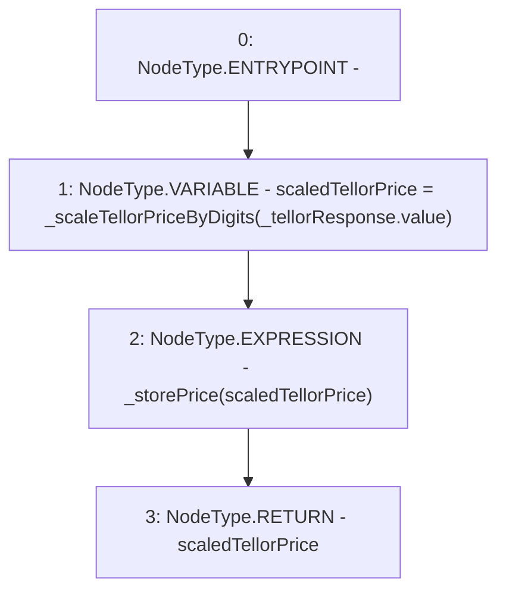

# Context: PriceFeedTester._storeTellorPrice

**Contract:** `PriceFeedTester` (Inherits: PriceFeed, IPriceFeed, BaseMath, CheckContract, Ownable)
**Signature:** `_storeTellorPrice(PriceFeed.TellorResponse) returns (uint256)`
**Method Selector ID:** `Internal (No Method ID)`
**Visibility:** `internal`
**Environment-Free:** `Yes`
**Modifiers:** None

### State Variables Interaction
- **Reads:** None
- **Writes:** None

### Environment & Verification Flags
- **Uses Foundry Cheatcodes:** No
- **Has Echidna Properties:** No

### Internal Calls Tree
- None

### External Calls / Value Transfers
- None

### Control Flow Graph (CFG)


### Source Mapping
Declared in: `certora-ac-datasets/detasets/web3bugs/dataset/web3bugs/66/packages/contracts/contracts/PriceFeed.sol` on lines **702** to **707**

```solidity
    function _storeTellorPrice(TellorResponse memory _tellorResponse) internal returns (uint) {
        uint scaledTellorPrice = _scaleTellorPriceByDigits(_tellorResponse.value);
        _storePrice(scaledTellorPrice);

        return scaledTellorPrice;
    }

```
