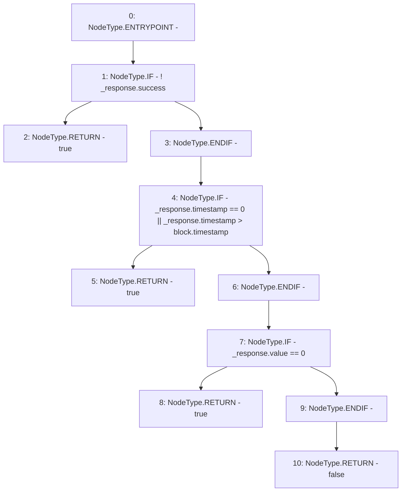

# Context: PriceFeedTester._tellorIsBroken

**Contract:** `PriceFeedTester` (Inherits: PriceFeed, IPriceFeed, BaseMath, CheckContract, Ownable)
**Signature:** `_tellorIsBroken(PriceFeed.TellorResponse) returns (bool)`
**Method Selector ID:** `Internal (No Method ID)`
**Visibility:** `internal`
**Environment-Free:** `No (reads EVM state context)`
**Modifiers:** None

### State Variables Interaction
- **Reads:** None
- **Writes:** None

### Environment & Verification Flags
- **Uses Foundry Cheatcodes:** No
- **Has Echidna Properties:** No

### Internal Calls Tree
- None

### External Calls / Value Transfers
- None

### Control Flow Graph (CFG)


### Source Mapping
Declared in: `certora-ac-datasets/detasets/web3bugs/dataset/web3bugs/66/packages/contracts/contracts/PriceFeed.sol` on lines **613** to **622**

```solidity
    function _tellorIsBroken(TellorResponse memory _response) internal view returns (bool) {
        // Check for response call reverted
        if (!_response.success) {return true;}
        // Check for an invalid timeStamp that is 0, or in the future
        if (_response.timestamp == 0 || _response.timestamp > block.timestamp) {return true;}
        // Check for zero price
        if (_response.value == 0) {return true;}

        return false;
    }

```
