# Context: PriceFeedTester.fetchPrice_v

**Contract:** `PriceFeedTester` (Inherits: PriceFeed, IPriceFeed, BaseMath, CheckContract, Ownable)
**Signature:** `fetchPrice_v() returns (uint256)`
**Method Selector ID:** `0x9c3bc3e6`
**Visibility:** `external`
**Environment-Free:** `No (reads EVM state context)`
**Modifiers:** None

### State Variables Interaction
- **Reads:** lastGoodPrice, status
- **Writes:** None

### Environment & Verification Flags
- **Uses Foundry Cheatcodes:** No
- **Has Echidna Properties:** No

### Internal Calls Tree
- None

### External Calls / Value Transfers
- None

### Control Flow Graph (CFG)

```mermaid
flowchart TD
    Node_0["0: NodeType.ENTRYPOINT - "]
    Node_0 --> Node_1
    Node_1["1: NodeType.VARIABLE - chainlinkResponse = _getCurrentChainlinkResponse()"]
    Node_1 --> Node_2
    Node_2["2: NodeType.VARIABLE - prevChainlinkResponse = _getPrevChainlinkResponse(chainlinkResponse.roundId,chainlinkResponse.decimals)"]
    Node_2 --> Node_3
    Node_3["3: NodeType.VARIABLE - tellorResponse = _getCurrentTellorResponse()"]
    Node_3 --> Node_4
    Node_4["4: NodeType.IF - status == Status.chainlinkWorking"]
    Node_4 --> Node_5
    Node_4 --> Node_41
    Node_5["5: NodeType.IF - _chainlinkIsBroken(chainlinkResponse,prevChainlinkResponse)"]
    Node_5 --> Node_6
    Node_5 --> Node_14
    Node_6["6: NodeType.IF - _tellorIsBroken(tellorResponse)"]
    Node_6 --> Node_7
    Node_6 --> Node_8
    Node_7["7: NodeType.RETURN - lastGoodPrice"]
    Node_8["8: NodeType.ENDIF - "]
    Node_8 --> Node_9
    Node_9["9: NodeType.IF - _tellorIsFrozen(tellorResponse)"]
    Node_9 --> Node_10
    Node_9 --> Node_11
    Node_10["10: NodeType.RETURN - lastGoodPrice"]
    Node_11["11: NodeType.ENDIF - "]
    Node_11 --> Node_12
    Node_12["12: NodeType.VARIABLE - scaledTellorPrice = _scaleTellorPriceByDigits(tellorResponse.value)"]
    Node_12 --> Node_13
    Node_13["13: NodeType.RETURN - scaledTellorPrice"]
    Node_14["14: NodeType.ENDIF - "]
    Node_14 --> Node_15
    Node_15["15: NodeType.IF - _chainlinkIsFrozen(chainlinkResponse)"]
    Node_15 --> Node_16
    Node_15 --> Node_24
    Node_16["16: NodeType.IF - _tellorIsBroken(tellorResponse)"]
    Node_16 --> Node_17
    Node_16 --> Node_18
    Node_17["17: NodeType.RETURN - lastGoodPrice"]
    Node_18["18: NodeType.ENDIF - "]
    Node_18 --> Node_19
    Node_19["19: NodeType.IF - _tellorIsFrozen(tellorResponse)"]
    Node_19 --> Node_20
    Node_19 --> Node_21
    Node_20["20: NodeType.RETURN - lastGoodPrice"]
    Node_21["21: NodeType.ENDIF - "]
    Node_21 --> Node_22
    Node_22["22: NodeType.VARIABLE - scaledTellorPrice_scope_0 = _scaleTellorPriceByDigits(tellorResponse.value)"]
    Node_22 --> Node_23
    Node_23["23: NodeType.RETURN - scaledTellorPrice_scope_0"]
    Node_24["24: NodeType.ENDIF - "]
    Node_24 --> Node_25
    Node_25["25: NodeType.IF - _chainlinkPriceChangeAboveMax(chainlinkResponse,prevChainlinkResponse)"]
    Node_25 --> Node_26
    Node_25 --> Node_38
    Node_26["26: NodeType.IF - _tellorIsBroken(tellorResponse)"]
    Node_26 --> Node_27
    Node_26 --> Node_28
    Node_27["27: NodeType.RETURN - lastGoodPrice"]
    Node_28["28: NodeType.ENDIF - "]
    Node_28 --> Node_29
    Node_29["29: NodeType.IF - _tellorIsFrozen(tellorResponse)"]
    Node_29 --> Node_30
    Node_29 --> Node_31
    Node_30["30: NodeType.RETURN - lastGoodPrice"]
    Node_31["31: NodeType.ENDIF - "]
    Node_31 --> Node_32
    Node_32["32: NodeType.IF - _bothOraclesSimilarPrice(chainlinkResponse,tellorResponse)"]
    Node_32 --> Node_33
    Node_32 --> Node_35
    Node_33["33: NodeType.VARIABLE - scaledChainlinkPrice = _scaleChainlinkPriceByDigits(uint256(chainlinkResponse.answer),chainlinkResponse.decimals)"]
    Node_33 --> Node_34
    Node_34["34: NodeType.RETURN - scaledChainlinkPrice"]
    Node_35["35: NodeType.ENDIF - "]
    Node_35 --> Node_36
    Node_36["36: NodeType.VARIABLE - scaledTellorPrice_scope_1 = _scaleTellorPriceByDigits(tellorResponse.value)"]
    Node_36 --> Node_37
    Node_37["37: NodeType.RETURN - scaledTellorPrice_scope_1"]
    Node_38["38: NodeType.ENDIF - "]
    Node_38 --> Node_39
    Node_39["39: NodeType.VARIABLE - scaledChainlinkPrice_scope_2 = _scaleChainlinkPriceByDigits(uint256(chainlinkResponse.answer),chainlinkResponse.decimals)"]
    Node_39 --> Node_40
    Node_40["40: NodeType.RETURN - scaledChainlinkPrice_scope_2"]
    Node_41["41: NodeType.ENDIF - "]
    Node_41 --> Node_42
    Node_42["42: NodeType.IF - status == Status.usingTellorChainlinkUntrusted"]
    Node_42 --> Node_43
    Node_42 --> Node_55
    Node_43["43: NodeType.IF - _bothOraclesLiveAndUnbrokenAndSimilarPrice(chainlinkResponse,prevChainlinkResponse,tellorResponse)"]
    Node_43 --> Node_44
    Node_43 --> Node_46
    Node_44["44: NodeType.VARIABLE - scaledChainlinkPrice_scope_3 = _scaleChainlinkPriceByDigits(uint256(chainlinkResponse.answer),chainlinkResponse.decimals)"]
    Node_44 --> Node_45
    Node_45["45: NodeType.RETURN - scaledChainlinkPrice_scope_3"]
    Node_46["46: NodeType.ENDIF - "]
    Node_46 --> Node_47
    Node_47["47: NodeType.IF - _tellorIsBroken(tellorResponse)"]
    Node_47 --> Node_48
    Node_47 --> Node_49
    Node_48["48: NodeType.RETURN - lastGoodPrice"]
    Node_49["49: NodeType.ENDIF - "]
    Node_49 --> Node_50
    Node_50["50: NodeType.IF - _tellorIsFrozen(tellorResponse)"]
    Node_50 --> Node_51
    Node_50 --> Node_52
    Node_51["51: NodeType.RETURN - lastGoodPrice"]
    Node_52["52: NodeType.ENDIF - "]
    Node_52 --> Node_53
    Node_53["53: NodeType.VARIABLE - scaledTellorPrice_scope_4 = _scaleTellorPriceByDigits(tellorResponse.value)"]
    Node_53 --> Node_54
    Node_54["54: NodeType.RETURN - scaledTellorPrice_scope_4"]
    Node_55["55: NodeType.ENDIF - "]
    Node_55 --> Node_56
    Node_56["56: NodeType.IF - status == Status.bothOraclesUntrusted"]
    Node_56 --> Node_57
    Node_56 --> Node_62
    Node_57["57: NodeType.IF - _bothOraclesLiveAndUnbrokenAndSimilarPrice(chainlinkResponse,prevChainlinkResponse,tellorResponse)"]
    Node_57 --> Node_58
    Node_57 --> Node_60
    Node_58["58: NodeType.VARIABLE - scaledChainlinkPrice_scope_5 = _scaleChainlinkPriceByDigits(uint256(chainlinkResponse.answer),chainlinkResponse.decimals)"]
    Node_58 --> Node_59
    Node_59["59: NodeType.RETURN - scaledChainlinkPrice_scope_5"]
    Node_60["60: NodeType.ENDIF - "]
    Node_60 --> Node_61
    Node_61["61: NodeType.RETURN - lastGoodPrice"]
    Node_62["62: NodeType.ENDIF - "]
    Node_62 --> Node_63
    Node_63["63: NodeType.IF - status == Status.usingTellorChainlinkFrozen"]
    Node_63 --> Node_64
    Node_63 --> Node_97
    Node_64["64: NodeType.IF - _chainlinkIsBroken(chainlinkResponse,prevChainlinkResponse)"]
    Node_64 --> Node_65
    Node_64 --> Node_73
    Node_65["65: NodeType.IF - _tellorIsBroken(tellorResponse)"]
    Node_65 --> Node_66
    Node_65 --> Node_67
    Node_66["66: NodeType.RETURN - lastGoodPrice"]
    Node_67["67: NodeType.ENDIF - "]
    Node_67 --> Node_68
    Node_68["68: NodeType.IF - _tellorIsFrozen(tellorResponse)"]
    Node_68 --> Node_69
    Node_68 --> Node_70
    Node_69["69: NodeType.RETURN - lastGoodPrice"]
    Node_70["70: NodeType.ENDIF - "]
    Node_70 --> Node_71
    Node_71["71: NodeType.VARIABLE - scaledTellorPrice_scope_6 = _scaleTellorPriceByDigits(tellorResponse.value)"]
    Node_71 --> Node_72
    Node_72["72: NodeType.RETURN - scaledTellorPrice_scope_6"]
    Node_73["73: NodeType.ENDIF - "]
    Node_73 --> Node_74
    Node_74["74: NodeType.IF - _chainlinkIsFrozen(chainlinkResponse)"]
    Node_74 --> Node_75
    Node_74 --> Node_83
    Node_75["75: NodeType.IF - _tellorIsBroken(tellorResponse)"]
    Node_75 --> Node_76
    Node_75 --> Node_77
    Node_76["76: NodeType.RETURN - lastGoodPrice"]
    Node_77["77: NodeType.ENDIF - "]
    Node_77 --> Node_78
    Node_78["78: NodeType.IF - _tellorIsFrozen(tellorResponse)"]
    Node_78 --> Node_79
    Node_78 --> Node_80
    Node_79["79: NodeType.RETURN - lastGoodPrice"]
    Node_80["80: NodeType.ENDIF - "]
    Node_80 --> Node_81
    Node_81["81: NodeType.VARIABLE - scaledTellorPrice_scope_7 = _scaleTellorPriceByDigits(tellorResponse.value)"]
    Node_81 --> Node_82
    Node_82["82: NodeType.RETURN - scaledTellorPrice_scope_7"]
    Node_83["83: NodeType.ENDIF - "]
    Node_83 --> Node_84
    Node_84["84: NodeType.IF - _tellorIsBroken(tellorResponse)"]
    Node_84 --> Node_85
    Node_84 --> Node_87
    Node_85["85: NodeType.VARIABLE - scaledChainlinkPrice_scope_8 = _scaleChainlinkPriceByDigits(uint256(chainlinkResponse.answer),chainlinkResponse.decimals)"]
    Node_85 --> Node_86
    Node_86["86: NodeType.RETURN - scaledChainlinkPrice_scope_8"]
    Node_87["87: NodeType.ENDIF - "]
    Node_87 --> Node_88
    Node_88["88: NodeType.IF - _tellorIsFrozen(tellorResponse)"]
    Node_88 --> Node_89
    Node_88 --> Node_90
    Node_89["89: NodeType.RETURN - lastGoodPrice"]
    Node_90["90: NodeType.ENDIF - "]
    Node_90 --> Node_91
    Node_91["91: NodeType.IF - _bothOraclesSimilarPrice(chainlinkResponse,tellorResponse)"]
    Node_91 --> Node_92
    Node_91 --> Node_94
    Node_92["92: NodeType.VARIABLE - scaledChainlinkPrice_scope_9 = _scaleChainlinkPriceByDigits(uint256(chainlinkResponse.answer),chainlinkResponse.decimals)"]
    Node_92 --> Node_93
    Node_93["93: NodeType.RETURN - scaledChainlinkPrice_scope_9"]
    Node_94["94: NodeType.ENDIF - "]
    Node_94 --> Node_95
    Node_95["95: NodeType.VARIABLE - scaledTellorPrice_scope_10 = _scaleTellorPriceByDigits(tellorResponse.value)"]
    Node_95 --> Node_96
    Node_96["96: NodeType.RETURN - scaledTellorPrice_scope_10"]
    Node_97["97: NodeType.ENDIF - "]
    Node_97 --> Node_98
    Node_98["98: NodeType.IF - status == Status.usingChainlinkTellorUntrusted"]
    Node_98 --> Node_99
    Node_98 --> Node_114
    Node_99["99: NodeType.IF - _chainlinkIsBroken(chainlinkResponse,prevChainlinkResponse)"]
    Node_99 --> Node_100
    Node_99 --> Node_101
    Node_100["100: NodeType.RETURN - lastGoodPrice"]
    Node_101["101: NodeType.ENDIF - "]
    Node_101 --> Node_102
    Node_102["102: NodeType.IF - _chainlinkIsFrozen(chainlinkResponse)"]
    Node_102 --> Node_103
    Node_102 --> Node_104
    Node_103["103: NodeType.RETURN - lastGoodPrice"]
    Node_104["104: NodeType.ENDIF - "]
    Node_104 --> Node_105
    Node_105["105: NodeType.IF - _bothOraclesLiveAndUnbrokenAndSimilarPrice(chainlinkResponse,prevChainlinkResponse,tellorResponse)"]
    Node_105 --> Node_106
    Node_105 --> Node_108
    Node_106["106: NodeType.VARIABLE - scaledChainlinkPrice_scope_11 = _scaleChainlinkPriceByDigits(uint256(chainlinkResponse.answer),chainlinkResponse.decimals)"]
    Node_106 --> Node_107
    Node_107["107: NodeType.RETURN - scaledChainlinkPrice_scope_11"]
    Node_108["108: NodeType.ENDIF - "]
    Node_108 --> Node_109
    Node_109["109: NodeType.IF - _chainlinkPriceChangeAboveMax(chainlinkResponse,prevChainlinkResponse)"]
    Node_109 --> Node_110
    Node_109 --> Node_111
    Node_110["110: NodeType.RETURN - lastGoodPrice"]
    Node_111["111: NodeType.ENDIF - "]
    Node_111 --> Node_112
    Node_112["112: NodeType.VARIABLE - scaledChainlinkPrice_scope_12 = _scaleChainlinkPriceByDigits(uint256(chainlinkResponse.answer),chainlinkResponse.decimals)"]
    Node_112 --> Node_113
    Node_113["113: NodeType.RETURN - scaledChainlinkPrice_scope_12"]
    Node_114["114: NodeType.ENDIF - "]
```


### Source Mapping
Declared in: `certora-ac-datasets/detasets/web3bugs/dataset/web3bugs/66/packages/contracts/contracts/PriceFeed.sol` on lines **350** to **563**

```solidity
    function fetchPrice_v() view external override returns (uint) {
        // Get current and previous price data from Chainlink, and current price data from Tellor
        ChainlinkResponse memory chainlinkResponse = _getCurrentChainlinkResponse();
        ChainlinkResponse memory prevChainlinkResponse = _getPrevChainlinkResponse(chainlinkResponse.roundId, chainlinkResponse.decimals);
        TellorResponse memory tellorResponse = _getCurrentTellorResponse();

        // --- CASE 1: System fetched last price from Chainlink  ---
        if (status == Status.chainlinkWorking) {
            // If Chainlink is broken, try Tellor
            if (_chainlinkIsBroken(chainlinkResponse, prevChainlinkResponse)) {
                // If Tellor is broken then both oracles are untrusted, so return the last good price
                if (_tellorIsBroken(tellorResponse)) {
                    return lastGoodPrice; 
                }
                /*
                * If Tellor is only frozen but otherwise returning valid data, return the last good price.
                * Tellor may need to be tipped to return current data.
                */
                if (_tellorIsFrozen(tellorResponse)) {
                    return lastGoodPrice;
                }
                
                // If Chainlink is broken and Tellor is working, switch to Tellor and return current Tellor price
                uint scaledTellorPrice = _scaleTellorPriceByDigits(tellorResponse.value);
                return scaledTellorPrice;
            }

            // If Chainlink is frozen, try Tellor
            if (_chainlinkIsFrozen(chainlinkResponse)) {          
                // If Tellor is broken too, remember Tellor broke, and return last good price
                if (_tellorIsBroken(tellorResponse)) {
                    return lastGoodPrice;     
                }

                // If Tellor is frozen or working, remember Chainlink froze, and switch to Tellor
                
               
                if (_tellorIsFrozen(tellorResponse)) {return lastGoodPrice;}

                // If Tellor is working, use it
                uint scaledTellorPrice = _scaleTellorPriceByDigits(tellorResponse.value);
                return scaledTellorPrice;
            }

            // If Chainlink price has changed by > 50% between two consecutive rounds, compare it to Tellor's price
            if (_chainlinkPriceChangeAboveMax(chainlinkResponse, prevChainlinkResponse)) {
                // If Tellor is broken, both oracles are untrusted, and return last good price
                 if (_tellorIsBroken(tellorResponse)) {
                    
                    return lastGoodPrice;     
                }

                // If Tellor is frozen, switch to Tellor and return last good price 
                if (_tellorIsFrozen(tellorResponse)) { 
                    
                    return lastGoodPrice;
                }

                /* 
                * If Tellor is live and both oracles have a similar price, conclude that Chainlink's large price deviation between
                * two consecutive rounds was likely a legitmate market price movement, and so continue using Chainlink 
                */
                if (_bothOraclesSimilarPrice(chainlinkResponse, tellorResponse)) {
                    uint scaledChainlinkPrice = _scaleChainlinkPriceByDigits(uint256(chainlinkResponse.answer), chainlinkResponse.decimals);
                    return scaledChainlinkPrice;
                }               

                // If Tellor is live but the oracles differ too much in price, conclude that Chainlink's initial price deviation was
                // an oracle failure. Switch to Tellor, and use Tellor price
                
                uint scaledTellorPrice = _scaleTellorPriceByDigits(tellorResponse.value);
                return scaledTellorPrice;
            }

             

            // If Chainlink is working, return Chainlink current price (no status change)
            uint scaledChainlinkPrice = _scaleChainlinkPriceByDigits(uint256(chainlinkResponse.answer), chainlinkResponse.decimals);
            return scaledChainlinkPrice;
        }


        // --- CASE 2: The system fetched last price from Tellor --- 
        if (status == Status.usingTellorChainlinkUntrusted) { 
            // If both Tellor and Chainlink are live, unbroken, and reporting similar prices, switch back to Chainlink
            if (_bothOraclesLiveAndUnbrokenAndSimilarPrice(chainlinkResponse, prevChainlinkResponse, tellorResponse)) {
                
                uint scaledChainlinkPrice = _scaleChainlinkPriceByDigits(uint256(chainlinkResponse.answer), chainlinkResponse.decimals);
                return scaledChainlinkPrice;
            }

            if (_tellorIsBroken(tellorResponse)) {
        
                return lastGoodPrice; 
            }

            /*
            * If Tellor is only frozen but otherwise returning valid data, just return the last good price.
            * Tellor may need to be tipped to return current data.
            */
            if (_tellorIsFrozen(tellorResponse)) {return lastGoodPrice;}
            
            // Otherwise, use Tellor price
            uint scaledTellorPrice = _scaleTellorPriceByDigits(tellorResponse.value);
            return scaledTellorPrice;
        }

        // --- CASE 3: Both oracles were untrusted at the last price fetch ---
        if (status == Status.bothOraclesUntrusted) {
            /*
            * If both oracles are now live, unbroken and similar price, we assume that they are reporting
            * accurately, and so we switch back to Chainlink.
            */
            if (_bothOraclesLiveAndUnbrokenAndSimilarPrice(chainlinkResponse, prevChainlinkResponse, tellorResponse)) {
                
                uint scaledChainlinkPrice = _scaleChainlinkPriceByDigits(uint256(chainlinkResponse.answer), chainlinkResponse.decimals);
                return scaledChainlinkPrice;
            } 

            // Otherwise, return the last good price - both oracles are still untrusted (no status change)
            return lastGoodPrice;
        }

        // --- CASE 4: Using Tellor, and Chainlink is frozen ---
        if (status == Status.usingTellorChainlinkFrozen) {
            if (_chainlinkIsBroken(chainlinkResponse, prevChainlinkResponse)) {
                // If both Oracles are broken, return last good price
                if (_tellorIsBroken(tellorResponse)) {
                    
                    return lastGoodPrice;
                }

                // If Chainlink is broken, remember it and switch to using Tellor
                

                if (_tellorIsFrozen(tellorResponse)) {return lastGoodPrice;}

                // If Tellor is working, return Tellor current price
                uint scaledTellorPrice = _scaleTellorPriceByDigits(tellorResponse.value);
                return scaledTellorPrice;
            }

            if (_chainlinkIsFrozen(chainlinkResponse)) {
                // if Chainlink is frozen and Tellor is broken, remember Tellor broke, and return last good price
                if (_tellorIsBroken(tellorResponse)) {
                    
                    return lastGoodPrice;
                }

                // If both are frozen, just use lastGoodPrice
                if (_tellorIsFrozen(tellorResponse)) {return lastGoodPrice;}

                // if Chainlink is frozen and Tellor is working, keep using Tellor (no status change)
                uint scaledTellorPrice = _scaleTellorPriceByDigits(tellorResponse.value);
                return scaledTellorPrice;
            }

            // if Chainlink is live and Tellor is broken, remember Tellor broke, and return Chainlink price
            if (_tellorIsBroken(tellorResponse)) {
               
                uint scaledChainlinkPrice = _scaleChainlinkPriceByDigits(uint256(chainlinkResponse.answer), chainlinkResponse.decimals);
                return scaledChainlinkPrice;
            }

             // If Chainlink is live and Tellor is frozen, just use last good price (no status change) since we have no basis for comparison
            if (_tellorIsFrozen(tellorResponse)) {return lastGoodPrice;}

            // If Chainlink is live and Tellor is working, compare prices. Switch to Chainlink
            // if prices are within 5%, and return Chainlink price.
            if (_bothOraclesSimilarPrice(chainlinkResponse, tellorResponse)) {
                
                uint scaledChainlinkPrice = _scaleChainlinkPriceByDigits(uint256(chainlinkResponse.answer), chainlinkResponse.decimals);
                return scaledChainlinkPrice;
            }

            // Otherwise if Chainlink is live but price not within 5% of Tellor, distrust Chainlink, and return Tellor price
           
            uint scaledTellorPrice = _scaleTellorPriceByDigits(tellorResponse.value);
            return scaledTellorPrice;
        }

        // --- CASE 5: Using Chainlink, Tellor is untrusted ---
         if (status == Status.usingChainlinkTellorUntrusted) {
            // If Chainlink breaks, now both oracles are untrusted
            if (_chainlinkIsBroken(chainlinkResponse, prevChainlinkResponse)) {
                
                return lastGoodPrice;
            }

            // If Chainlink is frozen, return last good price (no status change)
            if (_chainlinkIsFrozen(chainlinkResponse)) {
                return lastGoodPrice;
            }

            // If Chainlink and Tellor are both live, unbroken and similar price, switch back to chainlinkWorking and return Chainlink price
            if (_bothOraclesLiveAndUnbrokenAndSimilarPrice(chainlinkResponse, prevChainlinkResponse, tellorResponse)) {
                
                uint scaledChainlinkPrice = _scaleChainlinkPriceByDigits(uint256(chainlinkResponse.answer), chainlinkResponse.decimals);
                return scaledChainlinkPrice;
            }

            // If Chainlink is live but deviated >50% from it's previous price and Tellor is still untrusted, switch 
            // to bothOraclesUntrusted and return last good price
            if (_chainlinkPriceChangeAboveMax(chainlinkResponse, prevChainlinkResponse)) {
                
                return lastGoodPrice;
            }

            // Otherwise if Chainlink is live and deviated <50% from it's previous price and Tellor is still untrusted, 
            // return Chainlink price (no status change)
            uint scaledChainlinkPrice = _scaleChainlinkPriceByDigits(uint256(chainlinkResponse.answer), chainlinkResponse.decimals);
            return scaledChainlinkPrice;
        }
    }

```
