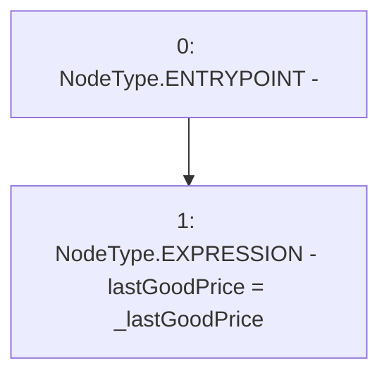

# Context: PriceFeedTester.setLastGoodPrice

**Contract:** `PriceFeedTester` (Inherits: PriceFeed, IPriceFeed, BaseMath, CheckContract, Ownable)
**Signature:** `setLastGoodPrice(uint256)`
**Method Selector ID:** `0xc521b3f5`
**Visibility:** `external`
**Environment-Free:** `Yes`
**Modifiers:** None

### State Variables Interaction
- **Reads:** None
- **Writes:** lastGoodPrice

### Environment & Verification Flags
- **Uses Foundry Cheatcodes:** No
- **Has Echidna Properties:** No

### Internal Calls Tree
- None

### External Calls / Value Transfers
- None

### Control Flow Graph (CFG)


### Source Mapping
Declared in: `certora-ac-datasets/detasets/web3bugs/dataset/web3bugs/66/packages/contracts/contracts/TestContracts/PriceFeedTester.sol` on lines **9** to **11**

```solidity
    function setLastGoodPrice(uint _lastGoodPrice) external {
        lastGoodPrice = _lastGoodPrice;
    }

```
