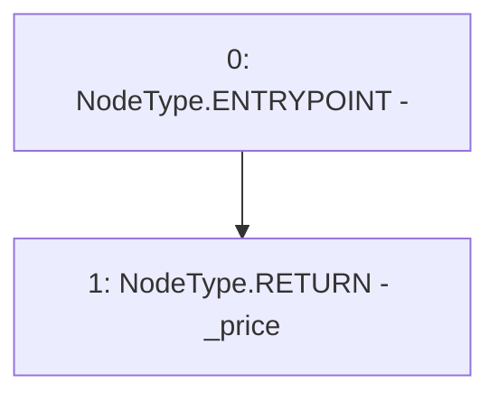

# Context: PriceFeedTestnet.getPrice

**Contract:** `PriceFeedTestnet` (Inherits: IPriceFeed)
**Signature:** `getPrice() returns (uint256)`
**Method Selector ID:** `0x98d5fdca`
**Visibility:** `external`
**Environment-Free:** `Yes`
**Modifiers:** None

### State Variables Interaction
- **Reads:** _price
- **Writes:** None

### Environment & Verification Flags
- **Uses Foundry Cheatcodes:** No
- **Has Echidna Properties:** No

### Internal Calls Tree
- None

### External Calls / Value Transfers
- None

### Control Flow Graph (CFG)


### Source Mapping
Declared in: `certora-ac-datasets/detasets/web3bugs/dataset/web3bugs/66/packages/contracts/contracts/TestContracts/PriceFeedTestnet.sol` on lines **18** to **20**

```solidity
    function getPrice() external view returns (uint256) {
        return _price;
    }

```
