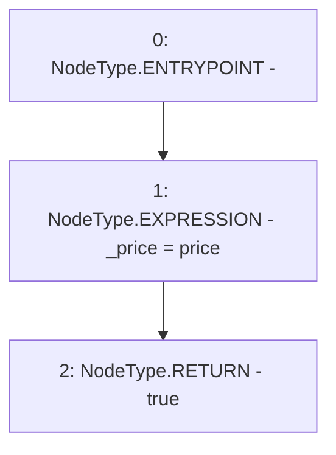

# Context: PriceFeedTestnet.setPrice

**Contract:** `PriceFeedTestnet` (Inherits: IPriceFeed)
**Signature:** `setPrice(uint256) returns (bool)`
**Method Selector ID:** `0x91b7f5ed`
**Visibility:** `external`
**Environment-Free:** `Yes`
**Modifiers:** None

### State Variables Interaction
- **Reads:** None
- **Writes:** _price

### Environment & Verification Flags
- **Uses Foundry Cheatcodes:** No
- **Has Echidna Properties:** No

### Internal Calls Tree
- None

### External Calls / Value Transfers
- None

### Control Flow Graph (CFG)


### Source Mapping
Declared in: `certora-ac-datasets/detasets/web3bugs/dataset/web3bugs/66/packages/contracts/contracts/TestContracts/PriceFeedTestnet.sol` on lines **34** to **37**

```solidity
    function setPrice(uint256 price) external returns (bool) {
        _price = price;
        return true;
    }

```
