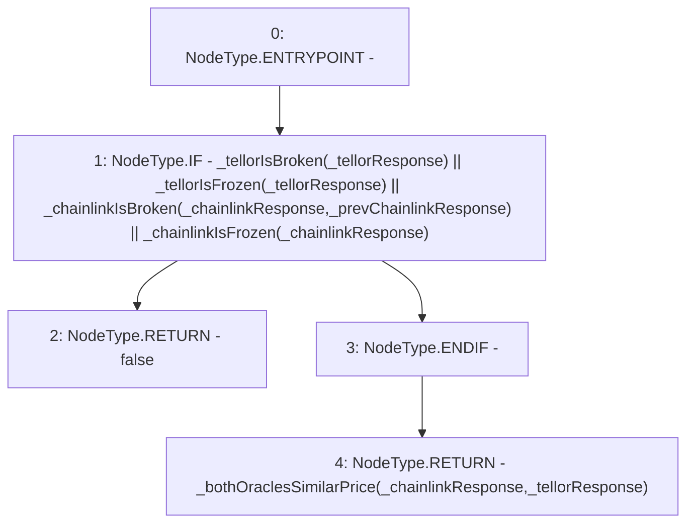

# Context: PriceFeed._bothOraclesLiveAndUnbrokenAndSimilarPrice

**Contract:** `PriceFeed` (Inherits: IPriceFeed, BaseMath, CheckContract, Ownable)
**Signature:** `_bothOraclesLiveAndUnbrokenAndSimilarPrice(PriceFeed.ChainlinkResponse,PriceFeed.ChainlinkResponse,PriceFeed.TellorResponse) returns (bool)`
**Method Selector ID:** `Internal (No Method ID)`
**Visibility:** `internal`
**Environment-Free:** `No (reads EVM state context)`
**Modifiers:** None

### State Variables Interaction
- **Reads:** None
- **Writes:** None

### Environment & Verification Flags
- **Uses Foundry Cheatcodes:** No
- **Has Echidna Properties:** No

### Internal Calls Tree
- None

### External Calls / Value Transfers
- None

### Control Flow Graph (CFG)


### Source Mapping
Declared in: `certora-ac-datasets/detasets/web3bugs/dataset/web3bugs/66/packages/contracts/contracts/PriceFeed.sol` on lines **628** to **651**

```solidity
    function _bothOraclesLiveAndUnbrokenAndSimilarPrice
    (
        ChainlinkResponse memory _chainlinkResponse,
        ChainlinkResponse memory _prevChainlinkResponse,
        TellorResponse memory _tellorResponse
    )
    internal
    view
    returns (bool)
    {
        // Return false if either oracle is broken or frozen
        if
        (
            _tellorIsBroken(_tellorResponse) ||
            _tellorIsFrozen(_tellorResponse) ||
            _chainlinkIsBroken(_chainlinkResponse, _prevChainlinkResponse) ||
            _chainlinkIsFrozen(_chainlinkResponse)
        )
        {
            return false;
        }

        return _bothOraclesSimilarPrice(_chainlinkResponse, _tellorResponse);
    }

```
