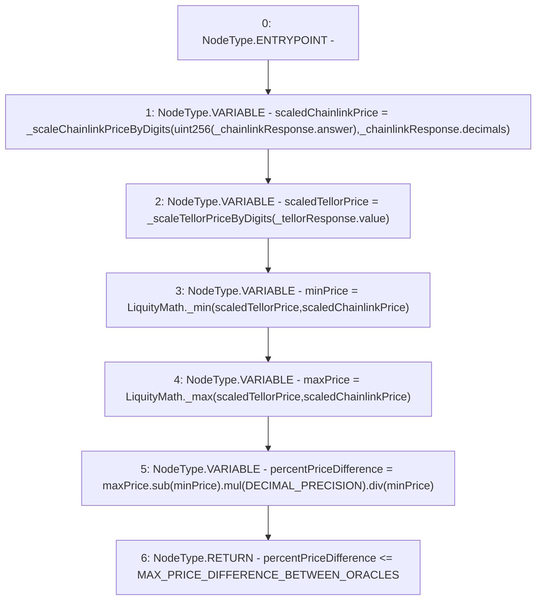

# Context: PriceFeed._bothOraclesSimilarPrice

**Contract:** `PriceFeed` (Inherits: IPriceFeed, BaseMath, CheckContract, Ownable)
**Signature:** `_bothOraclesSimilarPrice(PriceFeed.ChainlinkResponse,PriceFeed.TellorResponse) returns (bool)`
**Method Selector ID:** `Internal (No Method ID)`
**Visibility:** `internal`
**Environment-Free:** `Yes`
**Modifiers:** None

### State Variables Interaction
- **Reads:** DECIMAL_PRECISION, MAX_PRICE_DIFFERENCE_BETWEEN_ORACLES
- **Writes:** None

### Environment & Verification Flags
- **Uses Foundry Cheatcodes:** No
- **Has Echidna Properties:** No

### Internal Calls Tree
- None

### External Calls / Value Transfers
- `LiquityMath.TMP_254(uint256) = LIBRARY_CALL, dest:LiquityMath, function:LiquityMath._max(uint256,uint256), arguments:['scaledTellorPrice', 'scaledChainlinkPrice'] `
- `LiquityMath.TMP_253(uint256) = LIBRARY_CALL, dest:LiquityMath, function:LiquityMath._min(uint256,uint256), arguments:['scaledTellorPrice', 'scaledChainlinkPrice'] `
- `SafeMath.TMP_257(uint256) = LIBRARY_CALL, dest:SafeMath, function:SafeMath.div(uint256,uint256), arguments:['TMP_256', 'minPrice'] `
- `SafeMath.TMP_255(uint256) = LIBRARY_CALL, dest:SafeMath, function:SafeMath.sub(uint256,uint256), arguments:['maxPrice', 'minPrice'] `
- `SafeMath.TMP_256(uint256) = LIBRARY_CALL, dest:SafeMath, function:SafeMath.mul(uint256,uint256), arguments:['TMP_255', 'DECIMAL_PRECISION'] `

### Control Flow Graph (CFG)


### Source Mapping
Declared in: `certora-ac-datasets/detasets/web3bugs/dataset/web3bugs/66/packages/contracts/contracts/PriceFeed.sol` on lines **653** to **667**

```solidity
    function _bothOraclesSimilarPrice( ChainlinkResponse memory _chainlinkResponse, TellorResponse memory _tellorResponse) internal pure returns (bool) {
        uint scaledChainlinkPrice = _scaleChainlinkPriceByDigits(uint256(_chainlinkResponse.answer), _chainlinkResponse.decimals);
        uint scaledTellorPrice = _scaleTellorPriceByDigits(_tellorResponse.value);

        // Get the relative price difference between the oracles. Use the lower price as the denominator, i.e. the reference for the calculation.
        uint minPrice = LiquityMath._min(scaledTellorPrice, scaledChainlinkPrice);
        uint maxPrice = LiquityMath._max(scaledTellorPrice, scaledChainlinkPrice);
        uint percentPriceDifference = maxPrice.sub(minPrice).mul(DECIMAL_PRECISION).div(minPrice);

        /*
        * Return true if the relative price difference is <= 3%: if so, we assume both oracles are probably reporting
        * the honest market price, as it is unlikely that both have been broken/hacked and are still in-sync.
        */
        return percentPriceDifference <= MAX_PRICE_DIFFERENCE_BETWEEN_ORACLES;
    }

```
