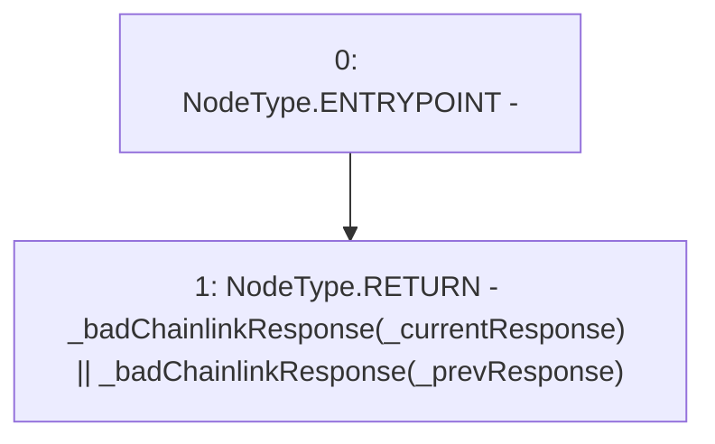

# Context: PriceFeed._chainlinkIsBroken

**Contract:** `PriceFeed` (Inherits: IPriceFeed, BaseMath, CheckContract, Ownable)
**Signature:** `_chainlinkIsBroken(PriceFeed.ChainlinkResponse,PriceFeed.ChainlinkResponse) returns (bool)`
**Method Selector ID:** `Internal (No Method ID)`
**Visibility:** `internal`
**Environment-Free:** `No (reads EVM state context)`
**Modifiers:** None

### State Variables Interaction
- **Reads:** None
- **Writes:** None

### Environment & Verification Flags
- **Uses Foundry Cheatcodes:** No
- **Has Echidna Properties:** No

### Internal Calls Tree
- None

### External Calls / Value Transfers
- None

### Control Flow Graph (CFG)


### Source Mapping
Declared in: `certora-ac-datasets/detasets/web3bugs/dataset/web3bugs/66/packages/contracts/contracts/PriceFeed.sol` on lines **574** to **576**

```solidity
    function _chainlinkIsBroken(ChainlinkResponse memory _currentResponse, ChainlinkResponse memory _prevResponse) internal view returns (bool) {
        return _badChainlinkResponse(_currentResponse) || _badChainlinkResponse(_prevResponse);
    }

```
