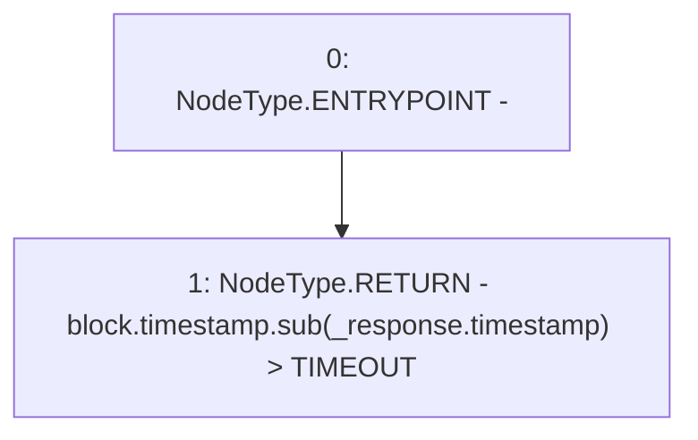

# Context: PriceFeed._chainlinkIsFrozen

**Contract:** `PriceFeed` (Inherits: IPriceFeed, BaseMath, CheckContract, Ownable)
**Signature:** `_chainlinkIsFrozen(PriceFeed.ChainlinkResponse) returns (bool)`
**Method Selector ID:** `Internal (No Method ID)`
**Visibility:** `internal`
**Environment-Free:** `No (reads EVM state context)`
**Modifiers:** None

### State Variables Interaction
- **Reads:** TIMEOUT
- **Writes:** None

### Environment & Verification Flags
- **Uses Foundry Cheatcodes:** No
- **Has Echidna Properties:** No

### Internal Calls Tree
- None

### External Calls / Value Transfers
- `SafeMath.TMP_223(uint256) = LIBRARY_CALL, dest:SafeMath, function:SafeMath.sub(uint256,uint256), arguments:['block.timestamp', 'REF_79'] `

### Control Flow Graph (CFG)


### Source Mapping
Declared in: `certora-ac-datasets/detasets/web3bugs/dataset/web3bugs/66/packages/contracts/contracts/PriceFeed.sol` on lines **591** to **593**

```solidity
    function _chainlinkIsFrozen(ChainlinkResponse memory _response) internal view returns (bool) {
        return block.timestamp.sub(_response.timestamp) > TIMEOUT;
    }

```
