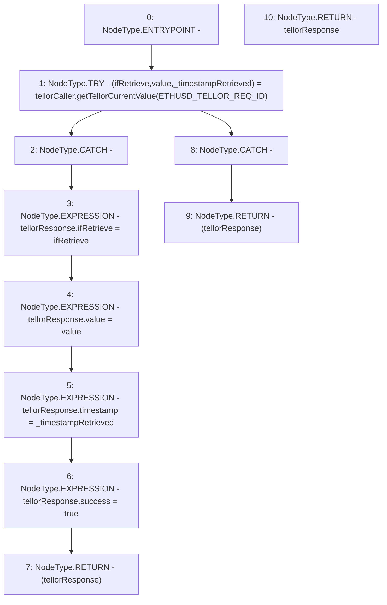

# Context: PriceFeed._getCurrentTellorResponse

**Contract:** `PriceFeed` (Inherits: IPriceFeed, BaseMath, CheckContract, Ownable)
**Signature:** `_getCurrentTellorResponse() returns (PriceFeed.TellorResponse)`
**Method Selector ID:** `Internal (No Method ID)`
**Visibility:** `internal`
**Environment-Free:** `Yes`
**Modifiers:** None

### State Variables Interaction
- **Reads:** ETHUSD_TELLOR_REQ_ID, tellorCaller
- **Writes:** None

### Environment & Verification Flags
- **Uses Foundry Cheatcodes:** No
- **Has Echidna Properties:** No

### Internal Calls Tree
- None

### External Calls / Value Transfers
- `ITellorCaller.TUPLE_0(bool,uint256,uint256) = HIGH_LEVEL_CALL, dest:tellorCaller(ITellorCaller), function:getTellorCurrentValue, arguments:['ETHUSD_TELLOR_REQ_ID']  `

### Control Flow Graph (CFG)


### Source Mapping
Declared in: `certora-ac-datasets/detasets/web3bugs/dataset/web3bugs/66/packages/contracts/contracts/PriceFeed.sol` on lines **718** to **737**

```solidity
    function _getCurrentTellorResponse() internal view returns (TellorResponse memory tellorResponse) {
        try tellorCaller.getTellorCurrentValue(ETHUSD_TELLOR_REQ_ID) returns
        (
            bool ifRetrieve,
            uint256 value,
            uint256 _timestampRetrieved
        )
        {
            // If call to Tellor succeeds, return the response and success = true
            tellorResponse.ifRetrieve = ifRetrieve;
            tellorResponse.value = value;
            tellorResponse.timestamp = _timestampRetrieved;
            tellorResponse.success = true;

            return (tellorResponse);
        }catch {
            // If call to Tellor reverts, return a zero response with success = false
            return (tellorResponse);
        }
    }

```
