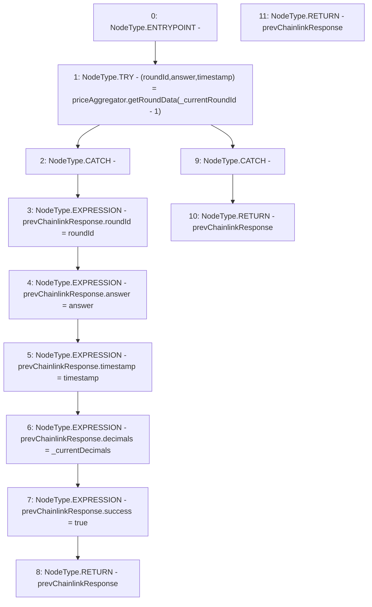

# Context: PriceFeed._getPrevChainlinkResponse

**Contract:** `PriceFeed` (Inherits: IPriceFeed, BaseMath, CheckContract, Ownable)
**Signature:** `_getPrevChainlinkResponse(uint80,uint8) returns (PriceFeed.ChainlinkResponse)`
**Method Selector ID:** `Internal (No Method ID)`
**Visibility:** `internal`
**Environment-Free:** `Yes`
**Modifiers:** None

### State Variables Interaction
- **Reads:** priceAggregator
- **Writes:** None

### Environment & Verification Flags
- **Uses Foundry Cheatcodes:** No
- **Has Echidna Properties:** No

### Internal Calls Tree
- None

### External Calls / Value Transfers
- `AggregatorV3Interface.TUPLE_2(uint80,int256,uint256,uint256,uint80) = HIGH_LEVEL_CALL, dest:priceAggregator(AggregatorV3Interface), function:getRoundData, arguments:['TMP_278']  `

### Control Flow Graph (CFG)


### Source Mapping
Declared in: `certora-ac-datasets/detasets/web3bugs/dataset/web3bugs/66/packages/contracts/contracts/PriceFeed.sol` on lines **771** to **798**

```solidity
    function _getPrevChainlinkResponse(uint80 _currentRoundId, uint8 _currentDecimals) internal view returns (ChainlinkResponse memory prevChainlinkResponse) {
        /*
        * NOTE: Chainlink only offers a current decimals() value - there is no way to obtain the decimal precision used in a
        * previous round.  We assume the decimals used in the previous round are the same as the current round.
        */

        // Try to get the price data from the previous round:
        try priceAggregator.getRoundData(_currentRoundId - 1) returns
        (
            uint80 roundId,
            int256 answer,
            uint256 /* startedAt */,
            uint256 timestamp,
            uint80 /* answeredInRound */
        )
        {
            // If call to Chainlink succeeds, return the response and success = true
            prevChainlinkResponse.roundId = roundId;
            prevChainlinkResponse.answer = answer;
            prevChainlinkResponse.timestamp = timestamp;
            prevChainlinkResponse.decimals = _currentDecimals;
            prevChainlinkResponse.success = true;
            return prevChainlinkResponse;
        } catch {
            // If call to Chainlink aggregator reverts, return a zero response with success = false
            return prevChainlinkResponse;
        }
    }

```
