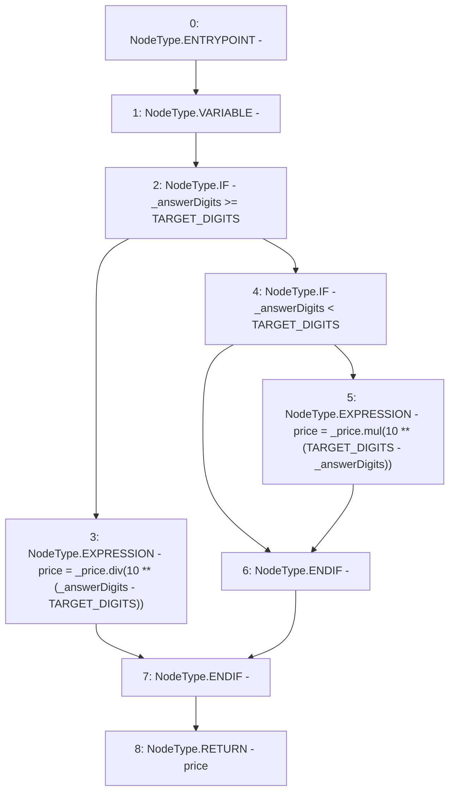

# Context: PriceFeed._scaleChainlinkPriceByDigits

**Contract:** `PriceFeed` (Inherits: IPriceFeed, BaseMath, CheckContract, Ownable)
**Signature:** `_scaleChainlinkPriceByDigits(uint256,uint256) returns (uint256)`
**Method Selector ID:** `Internal (No Method ID)`
**Visibility:** `internal`
**Environment-Free:** `Yes`
**Modifiers:** None

### State Variables Interaction
- **Reads:** TARGET_DIGITS
- **Writes:** None

### Environment & Verification Flags
- **Uses Foundry Cheatcodes:** No
- **Has Echidna Properties:** No

### Internal Calls Tree
- None

### External Calls / Value Transfers
- `SafeMath.TMP_262(uint256) = LIBRARY_CALL, dest:SafeMath, function:SafeMath.div(uint256,uint256), arguments:['_price', 'TMP_261'] `
- `SafeMath.TMP_266(uint256) = LIBRARY_CALL, dest:SafeMath, function:SafeMath.mul(uint256,uint256), arguments:['_price', 'TMP_265'] `

### Control Flow Graph (CFG)


### Source Mapping
Declared in: `certora-ac-datasets/detasets/web3bugs/dataset/web3bugs/66/packages/contracts/contracts/PriceFeed.sol` on lines **669** to **686**

```solidity
    function _scaleChainlinkPriceByDigits(uint _price, uint _answerDigits) internal pure returns (uint) {
        /*
        * Convert the price returned by the Chainlink oracle to an 18-digit decimal for use by Liquity.
        * At date of Liquity launch, Chainlink uses an 8-digit price, but we also handle the possibility of
        * future changes.
        *
        */
        uint price;
        if (_answerDigits >= TARGET_DIGITS) {
            // Scale the returned price value down to Liquity's target precision
            price = _price.div(10 ** (_answerDigits - TARGET_DIGITS));
        }
        else if (_answerDigits < TARGET_DIGITS) {
            // Scale the returned price value up to Liquity's target precision
            price = _price.mul(10 ** (TARGET_DIGITS - _answerDigits));
        }
        return price;
    }

```
