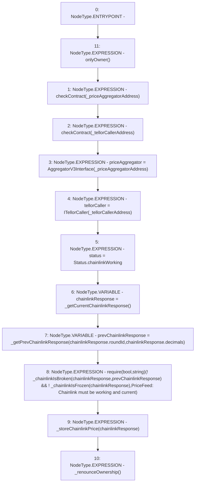

# Context: PriceFeed.setAddresses

**Contract:** `PriceFeed` (Inherits: IPriceFeed, BaseMath, CheckContract, Ownable)
**Signature:** `setAddresses(address,address)`
**Method Selector ID:** `0x90107afe`
**Visibility:** `external`
**Environment-Free:** `No (reads EVM state context)`
**Modifiers:**
- `onlyOwner`
  ```solidity
  modifier onlyOwner() {
          require(isOwner(), "CallerNotOwner");
          _;
      }
  ```

### State Variables Interaction
- **Reads:** None
- **Writes:** priceAggregator, status, tellorCaller

### Assertion Checks & Business Requirements
- require/assert: `require(bool,string)(! _chainlinkIsBroken(chainlinkResponse,prevChainlinkResponse) && ! _chainlinkIsFrozen(chainlinkResponse),PriceFeed: Chainlink must be working and current)`

### Environment & Verification Flags
- **Uses Foundry Cheatcodes:** No
- **Has Echidna Properties:** No

### Internal Calls Tree
- None

### External Calls / Value Transfers
- None

### Control Flow Graph (CFG)


### Source Mapping
Declared in: `certora-ac-datasets/detasets/web3bugs/dataset/web3bugs/66/packages/contracts/contracts/PriceFeed.sol` on lines **87** to **113**

```solidity
    function setAddresses(
        address _priceAggregatorAddress,
        address _tellorCallerAddress
    )
    external
    onlyOwner
    {
        checkContract(_priceAggregatorAddress);
        checkContract(_tellorCallerAddress);

        priceAggregator = AggregatorV3Interface(_priceAggregatorAddress);
        tellorCaller = ITellorCaller(_tellorCallerAddress);

        // Explicitly set initial system status
        status = Status.chainlinkWorking;

        // Get an initial price from Chainlink to serve as first reference for lastGoodPrice
        ChainlinkResponse memory chainlinkResponse = _getCurrentChainlinkResponse();
        ChainlinkResponse memory prevChainlinkResponse = _getPrevChainlinkResponse(chainlinkResponse.roundId, chainlinkResponse.decimals);

        require(!_chainlinkIsBroken(chainlinkResponse, prevChainlinkResponse) && !_chainlinkIsFrozen(chainlinkResponse),
            "PriceFeed: Chainlink must be working and current");

        _storeChainlinkPrice(chainlinkResponse);

        _renounceOwnership();
    }

```
