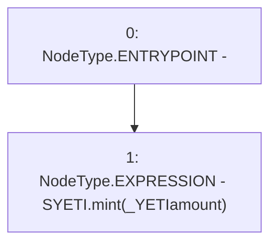

# Context: SYETIScript.stake

**Contract:** `SYETIScript` (Inherits: CheckContract)
**Signature:** `stake(uint256)`
**Method Selector ID:** `0xa694fc3a`
**Visibility:** `external`
**Environment-Free:** `Yes`
**Modifiers:** None

### State Variables Interaction
- **Reads:** SYETI
- **Writes:** None

### Environment & Verification Flags
- **Uses Foundry Cheatcodes:** No
- **Has Echidna Properties:** No

### Internal Calls Tree
- None

### External Calls / Value Transfers
- `ISYETI.TMP_12(bool) = HIGH_LEVEL_CALL, dest:SYETI(ISYETI), function:mint, arguments:['_YETIamount']  `

### Control Flow Graph (CFG)


### Source Mapping
Declared in: `certora-ac-datasets/detasets/web3bugs/dataset/web3bugs/66/packages/contracts/contracts/Proxy/SYETIScript.sol` on lines **17** to **19**

```solidity
    function stake(uint _YETIamount) external {
        SYETI.mint(_YETIamount);
    }

```
