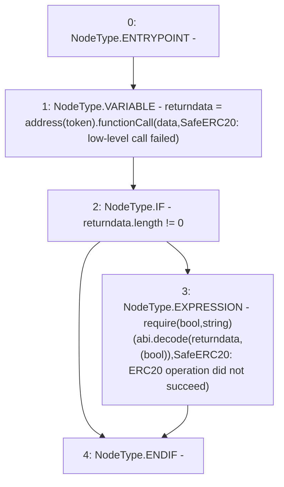

# Context: SafeERC20._callOptionalReturn

**Contract:** `SafeERC20` (Inherits: None)
**Signature:** `_callOptionalReturn(IERC20,bytes)`
**Method Selector ID:** `Internal (No Method ID)`
**Visibility:** `private`
**Environment-Free:** `Yes`
**Modifiers:** None

### State Variables Interaction
- **Reads:** None
- **Writes:** None

### Assertion Checks & Business Requirements
- require/assert: `require(bool,string)(abi.decode(returndata,(bool)),SafeERC20: ERC20 operation did not succeed)`

### Environment & Verification Flags
- **Uses Foundry Cheatcodes:** No
- **Has Echidna Properties:** No

### Internal Calls Tree
- None

### External Calls / Value Transfers
- `Address.TMP_54(bytes) = LIBRARY_CALL, dest:Address, function:Address.functionCall(address,bytes,string), arguments:['TMP_53', 'data', 'SafeERC20: low-level call failed'] `

### Control Flow Graph (CFG)


### Source Mapping
Declared in: `certora-ac-datasets/detasets/web3bugs/dataset/web3bugs/66/packages/contracts/contracts/Dependencies/SafeERC20.sol` on lines **86** to **96**

```solidity
    function _callOptionalReturn(IERC20 token, bytes memory data) private {
        // We need to perform a low level call here, to bypass Solidity's return data size checking mechanism, since
        // we're implementing it ourselves. We use {Address.functionCall} to perform this call, which verifies that
        // the target address contains contract code and also asserts for success in the low-level call.

        bytes memory returndata = address(token).functionCall(data, "SafeERC20: low-level call failed");
        if (returndata.length != 0) {
            // Return data is optional
            require(abi.decode(returndata, (bool)), "SafeERC20: ERC20 operation did not succeed");
        }
    }

```
