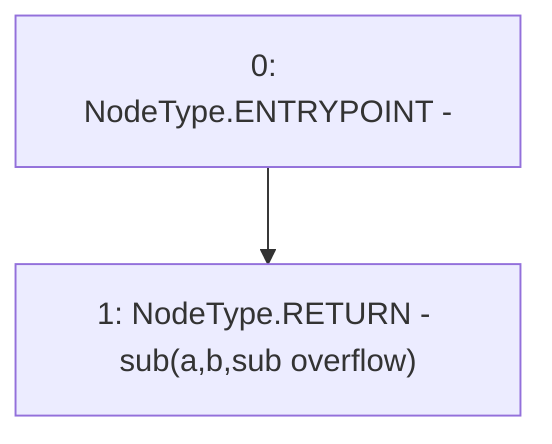

# Context: SafeMath.sub

**Contract:** `SafeMath` (Inherits: None)
**Signature:** `sub(uint256,uint256) returns (uint256)`
**Method Selector ID:** `Internal (No Method ID)`
**Visibility:** `internal`
**Environment-Free:** `Yes`
**Modifiers:** None

### State Variables Interaction
- **Reads:** None
- **Writes:** None

### Environment & Verification Flags
- **Uses Foundry Cheatcodes:** No
- **Has Echidna Properties:** No

### Internal Calls Tree
- None

### External Calls / Value Transfers
- None

### Control Flow Graph (CFG)


### Source Mapping
Declared in: `certora-ac-datasets/detasets/web3bugs/dataset/web3bugs/66/packages/contracts/contracts/Dependencies/SafeMath.sol` on lines **47** to **49**

```solidity
    function sub(uint256 a, uint256 b) internal pure returns (uint256) {
        return sub(a, b, "sub overflow");
    }

```
