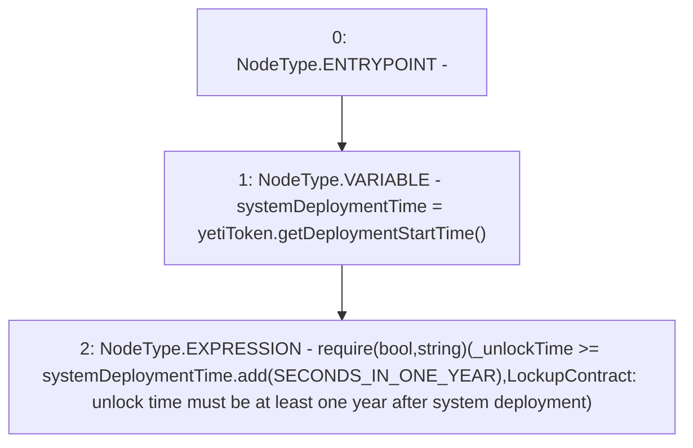

# Context: ShortLockupContract._requireUnlockTimeIsAtLeastOneYearAfterSystemDeployment

**Contract:** `ShortLockupContract` (Inherits: None)
**Signature:** `_requireUnlockTimeIsAtLeastOneYearAfterSystemDeployment(uint256)`
**Method Selector ID:** `Internal (No Method ID)`
**Visibility:** `internal`
**Environment-Free:** `Yes`
**Modifiers:** None

### State Variables Interaction
- **Reads:** SECONDS_IN_ONE_YEAR, yetiToken
- **Writes:** None

### Assertion Checks & Business Requirements
- require/assert: `require(bool,string)(_unlockTime >= systemDeploymentTime.add(SECONDS_IN_ONE_YEAR),LockupContract: unlock time must be at least one year after system deployment)`

### Environment & Verification Flags
- **Uses Foundry Cheatcodes:** No
- **Has Echidna Properties:** No

### Internal Calls Tree
- None

### External Calls / Value Transfers
- `IYETIToken.TMP_90(uint256) = HIGH_LEVEL_CALL, dest:yetiToken(IYETIToken), function:getDeploymentStartTime, arguments:[]  `
- `SafeMath.TMP_91(uint256) = LIBRARY_CALL, dest:SafeMath, function:SafeMath.add(uint256,uint256), arguments:['systemDeploymentTime', 'SECONDS_IN_ONE_YEAR'] `

### Control Flow Graph (CFG)


### Source Mapping
Declared in: `certora-ac-datasets/detasets/web3bugs/dataset/web3bugs/66/packages/contracts/contracts/YETI/ShortLockupContract.sol` on lines **77** to **80**

```solidity
    function _requireUnlockTimeIsAtLeastOneYearAfterSystemDeployment(uint _unlockTime) internal view {
        uint systemDeploymentTime = yetiToken.getDeploymentStartTime();
        require(_unlockTime >= systemDeploymentTime.add(SECONDS_IN_ONE_YEAR), "LockupContract: unlock time must be at least one year after system deployment");
    }

```
