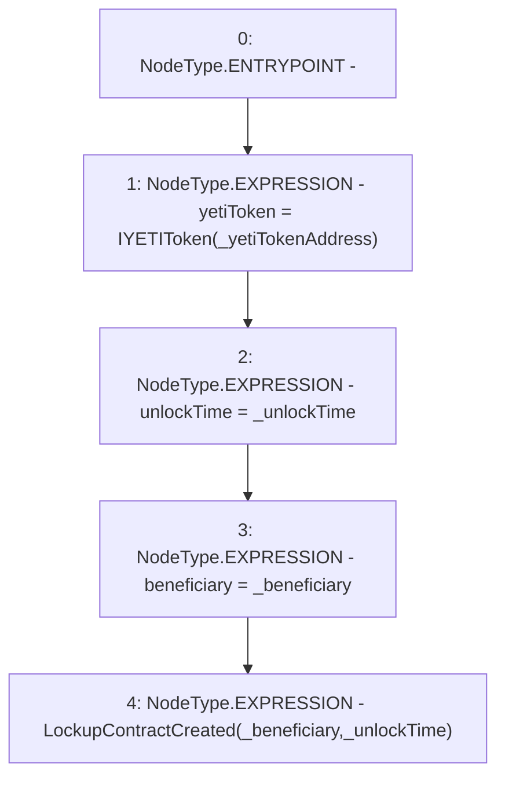

# Context: ShortLockupContract.constructor

**Contract:** `ShortLockupContract` (Inherits: None)
**Signature:** `constructor(address,address,uint256)`
**Method Selector ID:** `0x3bdb4e02`
**Visibility:** `public`
**Environment-Free:** `Yes`
**Modifiers:** None

### State Variables Interaction
- **Reads:** None
- **Writes:** beneficiary, unlockTime, yetiToken

### Environment & Verification Flags
- **Uses Foundry Cheatcodes:** No
- **Has Echidna Properties:** No

### Internal Calls Tree
- None

### External Calls / Value Transfers
- None

### Control Flow Graph (CFG)


### Source Mapping
Declared in: `certora-ac-datasets/detasets/web3bugs/dataset/web3bugs/66/packages/contracts/contracts/YETI/ShortLockupContract.sol` on lines **37** to **55**

```solidity
    constructor 
    (
        address _yetiTokenAddress,
        address _beneficiary, 
        uint _unlockTime
    )
        public 
    {
        yetiToken = IYETIToken(_yetiTokenAddress);

        /*
        * Set the unlock time to a chosen instant in the future, as long as it is at least 1 year after
        * the system was deployed 
        */
        unlockTime = _unlockTime;
        
        beneficiary =  _beneficiary;
        emit LockupContractCreated(_beneficiary, _unlockTime);
    }

```
