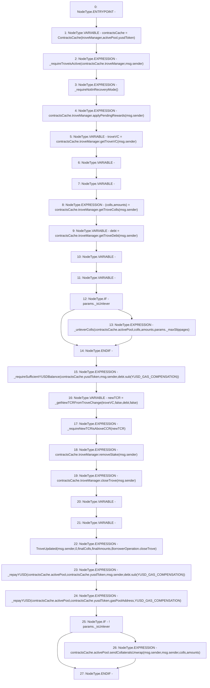

# Context: SortedTrovesBOTester._closeTrove

**Contract:** `SortedTrovesBOTester` (Inherits: BorrowerOperations, ReentrancyGuard, IBorrowerOperations, CheckContract, Ownable, LiquityBase, YetiCustomBase, BaseMath, ILiquityBase)
**Signature:** `_closeTrove(BorrowerOperations.CloseTrove_Params)`
**Method Selector ID:** `Internal (No Method ID)`
**Visibility:** `internal`
**Environment-Free:** `No (reads EVM state context)`
**Modifiers:** None

### State Variables Interaction
- **Reads:** YUSD_GAS_COMPENSATION, activePool, gasPoolAddress, troveManager, yusdToken
- **Writes:** None

### Environment & Verification Flags
- **Uses Foundry Cheatcodes:** No
- **Has Echidna Properties:** No

### Internal Calls Tree
- None

### External Calls / Value Transfers
- `ITroveManager.HIGH_LEVEL_CALL, dest:REF_1198(ITroveManager), function:applyPendingRewards, arguments:['msg.sender']  `
- `IActivePool.TMP_984(bool) = HIGH_LEVEL_CALL, dest:REF_1222(IActivePool), function:sendCollateralsUnwrap, arguments:['msg.sender', 'msg.sender', 'colls', 'amounts']  `
- `ITroveManager.TMP_970(uint256) = HIGH_LEVEL_CALL, dest:REF_1200(ITroveManager), function:getTroveVC, arguments:['msg.sender']  `
- `SafeMath.TMP_973(uint256) = LIBRARY_CALL, dest:SafeMath, function:SafeMath.sub(uint256,uint256), arguments:['debt', 'YUSD_GAS_COMPENSATION'] `
- `SafeMath.TMP_980(uint256) = LIBRARY_CALL, dest:SafeMath, function:SafeMath.sub(uint256,uint256), arguments:['debt', 'YUSD_GAS_COMPENSATION'] `
- `ITroveManager.TMP_971(uint256) = HIGH_LEVEL_CALL, dest:REF_1204(ITroveManager), function:getTroveDebt, arguments:['msg.sender']  `
- `ITroveManager.HIGH_LEVEL_CALL, dest:REF_1213(ITroveManager), function:closeTrove, arguments:['msg.sender']  `
- `ITroveManager.TUPLE_11(address[],uint256[]) = HIGH_LEVEL_CALL, dest:REF_1202(ITroveManager), function:getTroveColls, arguments:['msg.sender']  `
- `ITroveManager.HIGH_LEVEL_CALL, dest:REF_1211(ITroveManager), function:removeStake, arguments:['msg.sender']  `

### Control Flow Graph (CFG)


### Source Mapping
Declared in: `certora-ac-datasets/detasets/web3bugs/dataset/web3bugs/66/packages/contracts/contracts/BorrowerOperations.sol` on lines **906** to **953**

```solidity
    function _closeTrove(
        CloseTrove_Params memory params
        ) internal {
        ContractsCache memory contractsCache = ContractsCache(troveManager, activePool, yusdToken);

        _requireTroveisActive(contractsCache.troveManager, msg.sender);
        _requireNotInRecoveryMode();

        contractsCache.troveManager.applyPendingRewards(msg.sender);

        uint256 troveVC = contractsCache.troveManager.getTroveVC(msg.sender); // should get the latest VC
        (address[] memory colls, uint256[] memory amounts) = contractsCache.troveManager.getTroveColls(
            msg.sender
        );
        uint256 debt = contractsCache.troveManager.getTroveDebt(msg.sender);

        // if unlever, will do extra.
        uint finalYUSDAmount;
        uint YUSDAmount;
        if (params._isUnlever) {
            // Withdraw the collateral from active pool and perform swap using single unlever up and corresponding router. 
            _unleverColls(contractsCache.activePool, colls, amounts, params._maxSlippages);
            // tracks the amount of YUSD that is received from swaps. Will send the _YUSDAmount back to repay debt while keeping remainder.
        }

        // do check after unlever (if applies)
        _requireSufficientYUSDBalance(contractsCache.yusdToken, msg.sender, debt.sub(YUSD_GAS_COMPENSATION));
        uint256 newTCR = _getNewTCRFromTroveChange(troveVC, false, debt, false);
        _requireNewTCRisAboveCCR(newTCR);

        contractsCache.troveManager.removeStake(msg.sender);
        contractsCache.troveManager.closeTrove(msg.sender);

        address[] memory finalColls;
        uint256[] memory finalAmounts;

        emit TroveUpdated(msg.sender, 0, finalColls, finalAmounts, BorrowerOperation.closeTrove);

        // Burn the repaid YUSD from the user's balance and the gas compensation from the Gas Pool
        _repayYUSD(contractsCache.activePool, contractsCache.yusdToken, msg.sender, debt.sub(YUSD_GAS_COMPENSATION));
        _repayYUSD(contractsCache.activePool, contractsCache.yusdToken, gasPoolAddress, YUSD_GAS_COMPENSATION);

        // Send the collateral back to the user
        // Also sends the rewards
        if (!params._isUnlever) {
            contractsCache.activePool.sendCollateralsUnwrap(msg.sender, msg.sender, colls, amounts);
        }
    }

```
