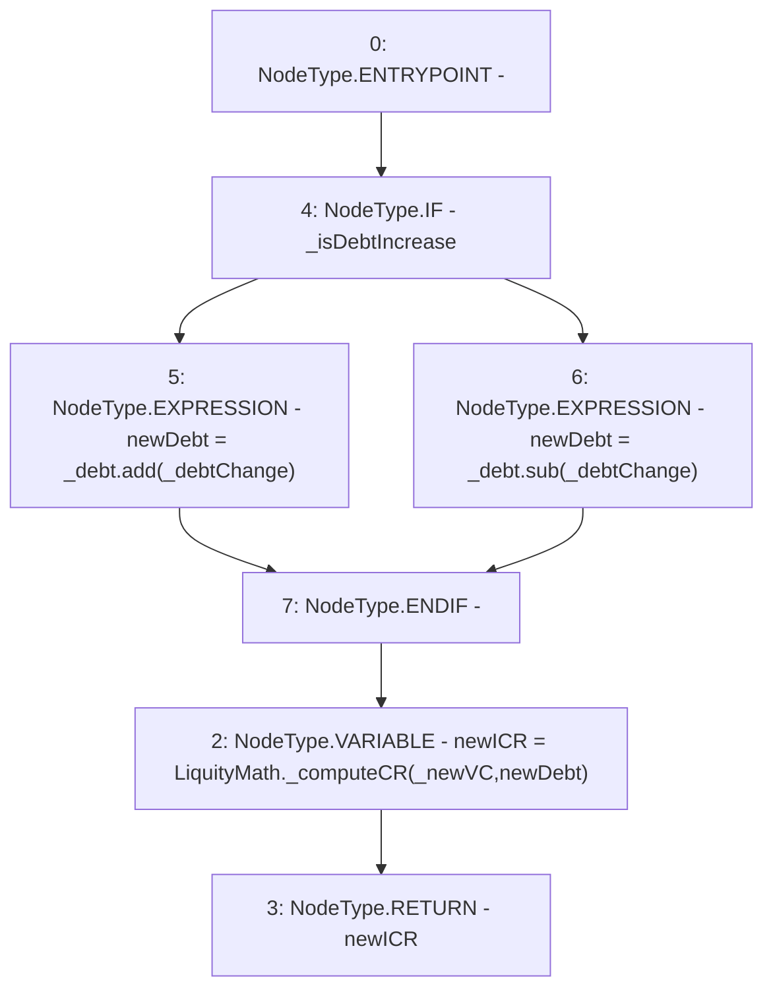

# Context: SortedTrovesBOTester._getNewICRFromTroveChange

**Contract:** `SortedTrovesBOTester` (Inherits: BorrowerOperations, ReentrancyGuard, IBorrowerOperations, CheckContract, Ownable, LiquityBase, YetiCustomBase, BaseMath, ILiquityBase)
**Signature:** `_getNewICRFromTroveChange(uint256,uint256,uint256,bool) returns (uint256)`
**Method Selector ID:** `Internal (No Method ID)`
**Visibility:** `internal`
**Environment-Free:** `Yes`
**Modifiers:** None

### State Variables Interaction
- **Reads:** None
- **Writes:** None

### Environment & Verification Flags
- **Uses Foundry Cheatcodes:** No
- **Has Echidna Properties:** No

### Internal Calls Tree
- None

### External Calls / Value Transfers
- `LiquityMath.TMP_1110(uint256) = LIBRARY_CALL, dest:LiquityMath, function:LiquityMath._computeCR(uint256,uint256), arguments:['_newVC', 'newDebt'] `
- `SafeMath.TMP_1112(uint256) = LIBRARY_CALL, dest:SafeMath, function:SafeMath.sub(uint256,uint256), arguments:['_debt', '_debtChange'] `
- `SafeMath.TMP_1111(uint256) = LIBRARY_CALL, dest:SafeMath, function:SafeMath.add(uint256,uint256), arguments:['_debt', '_debtChange'] `

### Control Flow Graph (CFG)


### Source Mapping
Declared in: `certora-ac-datasets/detasets/web3bugs/dataset/web3bugs/66/packages/contracts/contracts/BorrowerOperations.sol` on lines **1386** to **1396**

```solidity
    function _getNewICRFromTroveChange(
        uint256 _newVC,
        uint256 _debt,
        uint256 _debtChange,
        bool _isDebtIncrease
    ) internal pure returns (uint256) {
        uint256 newDebt = _isDebtIncrease ? _debt.add(_debtChange) : _debt.sub(_debtChange);

        uint256 newICR = LiquityMath._computeCR(_newVC, newDebt);
        return newICR;
    }

```
