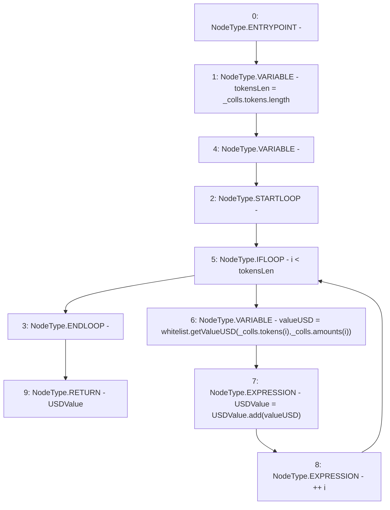

# Context: SortedTrovesBOTester._getUSDColls

**Contract:** `SortedTrovesBOTester` (Inherits: BorrowerOperations, ReentrancyGuard, IBorrowerOperations, CheckContract, Ownable, LiquityBase, YetiCustomBase, BaseMath, ILiquityBase)
**Signature:** `_getUSDColls(YetiCustomBase.newColls) returns (uint256)`
**Method Selector ID:** `Internal (No Method ID)`
**Visibility:** `internal`
**Environment-Free:** `Yes`
**Modifiers:** None

### State Variables Interaction
- **Reads:** whitelist
- **Writes:** None

### Environment & Verification Flags
- **Uses Foundry Cheatcodes:** No
- **Has Echidna Properties:** No

### Internal Calls Tree
- None

### External Calls / Value Transfers
- `SafeMath.TMP_1152(uint256) = LIBRARY_CALL, dest:SafeMath, function:SafeMath.add(uint256,uint256), arguments:['USDValue', 'valueUSD'] `
- `IWhitelist.TMP_1151(uint256) = HIGH_LEVEL_CALL, dest:whitelist(IWhitelist), function:getValueUSD, arguments:['REF_1345', 'REF_1347']  `

### Control Flow Graph (CFG)


### Source Mapping
Declared in: `certora-ac-datasets/detasets/web3bugs/dataset/web3bugs/66/packages/contracts/contracts/Dependencies/LiquityBase.sol` on lines **102** to **108**

```solidity
    function _getUSDColls(newColls memory _colls) internal view returns (uint USDValue) {
        uint256 tokensLen = _colls.tokens.length;
        for (uint256 i; i < tokensLen; ++i) {
            uint valueUSD = whitelist.getValueUSD(_colls.tokens[i], _colls.amounts[i]);
            USDValue = USDValue.add(valueUSD);
        }
    }

```
