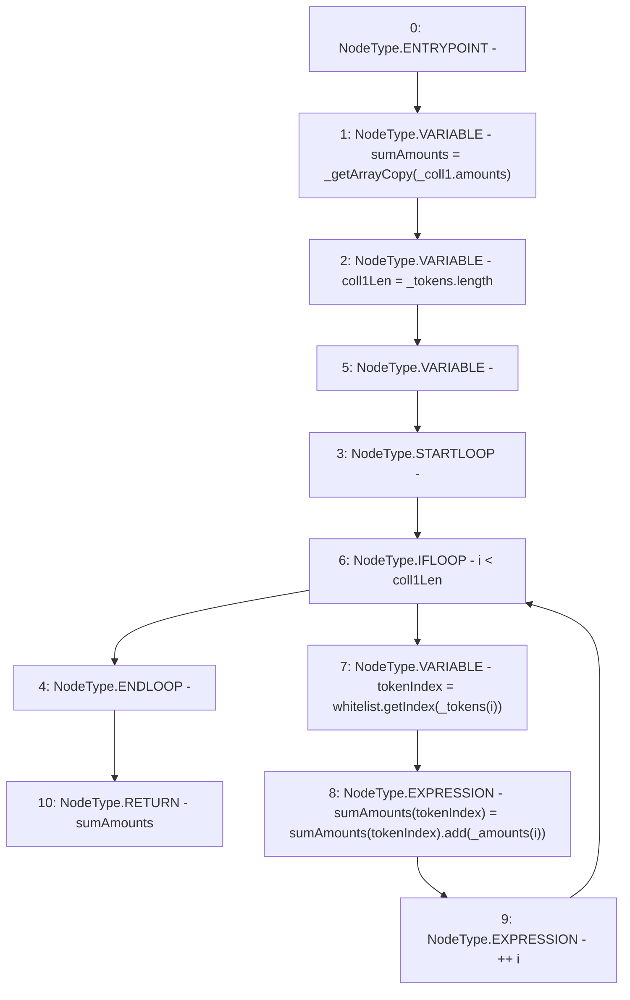

# Context: SortedTrovesBOTester._leftSumColls

**Contract:** `SortedTrovesBOTester` (Inherits: BorrowerOperations, ReentrancyGuard, IBorrowerOperations, CheckContract, Ownable, LiquityBase, YetiCustomBase, BaseMath, ILiquityBase)
**Signature:** `_leftSumColls(YetiCustomBase.newColls,address[],uint256[]) returns (uint256[])`
**Method Selector ID:** `Internal (No Method ID)`
**Visibility:** `internal`
**Environment-Free:** `Yes`
**Modifiers:** None

### State Variables Interaction
- **Reads:** whitelist
- **Writes:** None

### Environment & Verification Flags
- **Uses Foundry Cheatcodes:** No
- **Has Echidna Properties:** No

### Internal Calls Tree
- None

### External Calls / Value Transfers
- `SafeMath.TMP_1193(uint256) = LIBRARY_CALL, dest:SafeMath, function:SafeMath.add(uint256,uint256), arguments:['REF_1404', 'REF_1406'] `
- `IWhitelist.TMP_1192(uint256) = HIGH_LEVEL_CALL, dest:whitelist(IWhitelist), function:getIndex, arguments:['REF_1402']  `

### Control Flow Graph (CFG)


### Source Mapping
Declared in: `certora-ac-datasets/detasets/web3bugs/dataset/web3bugs/66/packages/contracts/contracts/Dependencies/YetiCustomBase.sol` on lines **99** to **114**

```solidity
    function _leftSumColls(
        newColls memory _coll1,
        address[] memory _tokens,
        uint256[] memory _amounts
    ) internal view returns (uint[] memory) {
        uint[] memory sumAmounts = _getArrayCopy(_coll1.amounts);

        uint256 coll1Len = _tokens.length;
        // assumes that sumAmounts length = whitelist tokens length.
        for (uint256 i; i < coll1Len; ++i) {
            uint tokenIndex = whitelist.getIndex(_tokens[i]);
            sumAmounts[tokenIndex] = sumAmounts[tokenIndex].add(_amounts[i]);
        }

        return sumAmounts;
    }

```
