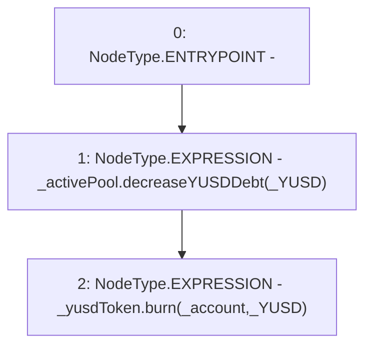

# Context: SortedTrovesBOTester._repayYUSD

**Contract:** `SortedTrovesBOTester` (Inherits: BorrowerOperations, ReentrancyGuard, IBorrowerOperations, CheckContract, Ownable, LiquityBase, YetiCustomBase, BaseMath, ILiquityBase)
**Signature:** `_repayYUSD(IActivePool,IYUSDToken,address,uint256)`
**Method Selector ID:** `Internal (No Method ID)`
**Visibility:** `internal`
**Environment-Free:** `Yes`
**Modifiers:** None

### State Variables Interaction
- **Reads:** None
- **Writes:** None

### Environment & Verification Flags
- **Uses Foundry Cheatcodes:** No
- **Has Echidna Properties:** No

### Internal Calls Tree
- None

### External Calls / Value Transfers
- `IActivePool.HIGH_LEVEL_CALL, dest:_activePool(IActivePool), function:decreaseYUSDDebt, arguments:['_YUSD']  `
- `IYUSDToken.HIGH_LEVEL_CALL, dest:_yusdToken(IYUSDToken), function:burn, arguments:['_account', '_YUSD']  `

### Control Flow Graph (CFG)


### Source Mapping
Declared in: `certora-ac-datasets/detasets/web3bugs/dataset/web3bugs/66/packages/contracts/contracts/BorrowerOperations.sol` on lines **1162** to **1170**

```solidity
    function _repayYUSD(
        IActivePool _activePool,
        IYUSDToken _yusdToken,
        address _account,
        uint256 _YUSD
    ) internal {
        _activePool.decreaseYUSDDebt(_YUSD);
        _yusdToken.burn(_account, _YUSD);
    }

```
