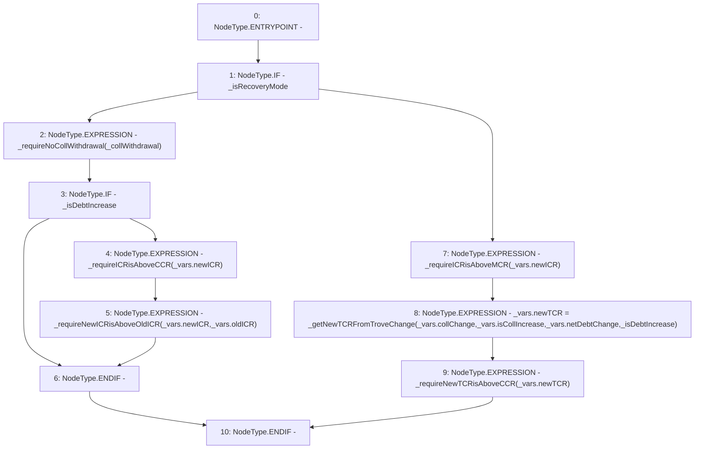

# Context: SortedTrovesBOTester._requireValidAdjustmentInCurrentMode

**Contract:** `SortedTrovesBOTester` (Inherits: BorrowerOperations, ReentrancyGuard, IBorrowerOperations, CheckContract, Ownable, LiquityBase, YetiCustomBase, BaseMath, ILiquityBase)
**Signature:** `_requireValidAdjustmentInCurrentMode(bool,uint256[],bool,BorrowerOperations.LocalVariables_adjustTrove)`
**Method Selector ID:** `Internal (No Method ID)`
**Visibility:** `internal`
**Environment-Free:** `Yes`
**Modifiers:** None

### State Variables Interaction
- **Reads:** None
- **Writes:** None

### Environment & Verification Flags
- **Uses Foundry Cheatcodes:** No
- **Has Echidna Properties:** No

### Internal Calls Tree
- None

### External Calls / Value Transfers
- None

### Control Flow Graph (CFG)


### Source Mapping
Declared in: `certora-ac-datasets/detasets/web3bugs/dataset/web3bugs/66/packages/contracts/contracts/BorrowerOperations.sol` on lines **1263** to **1299**

```solidity
    function _requireValidAdjustmentInCurrentMode(
        bool _isRecoveryMode,
        uint256[] memory _collWithdrawal,
        bool _isDebtIncrease,
        LocalVariables_adjustTrove memory _vars
    ) internal view {
        /*
         *In Recovery Mode, only allow:
         *
         * - Pure collateral top-up
         * - Pure debt repayment
         * - Collateral top-up with debt repayment
         * - A debt increase combined with a collateral top-up which makes the ICR >= 150% and improves the ICR (and by extension improves the TCR).
         *
         * In Normal Mode, ensure:
         *
         * - The new ICR is above MCR
         * - The adjustment won't pull the TCR below CCR
         */
        if (_isRecoveryMode) {
            _requireNoCollWithdrawal(_collWithdrawal);
            if (_isDebtIncrease) {
                _requireICRisAboveCCR(_vars.newICR);
                _requireNewICRisAboveOldICR(_vars.newICR, _vars.oldICR);
            }
        } else {
            // if Normal Mode
            _requireICRisAboveMCR(_vars.newICR);
            _vars.newTCR = _getNewTCRFromTroveChange(
                _vars.collChange,
                _vars.isCollIncrease,
                _vars.netDebtChange,
                _isDebtIncrease
            );
            _requireNewTCRisAboveCCR(_vars.newTCR);
        }
    }

```
