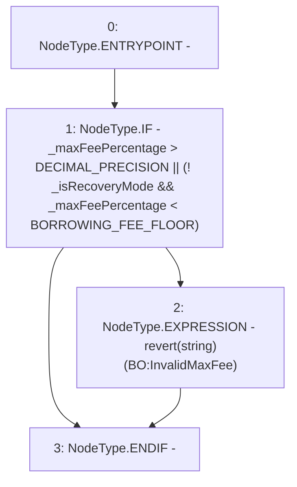

# Context: SortedTrovesBOTester._requireValidMaxFeePercentage

**Contract:** `SortedTrovesBOTester` (Inherits: BorrowerOperations, ReentrancyGuard, IBorrowerOperations, CheckContract, Ownable, LiquityBase, YetiCustomBase, BaseMath, ILiquityBase)
**Signature:** `_requireValidMaxFeePercentage(uint256,bool)`
**Method Selector ID:** `Internal (No Method ID)`
**Visibility:** `internal`
**Environment-Free:** `Yes`
**Modifiers:** None

### State Variables Interaction
- **Reads:** BORROWING_FEE_FLOOR, DECIMAL_PRECISION
- **Writes:** None

### Assertion Checks & Business Requirements
- revert: `revert(string)(BO:InvalidMaxFee)`

### Environment & Verification Flags
- **Uses Foundry Cheatcodes:** No
- **Has Echidna Properties:** No

### Internal Calls Tree
- None

### External Calls / Value Transfers
- None

### Control Flow Graph (CFG)


### Source Mapping
Declared in: `certora-ac-datasets/detasets/web3bugs/dataset/web3bugs/66/packages/contracts/contracts/BorrowerOperations.sol` on lines **1351** to **1359**

```solidity
    function _requireValidMaxFeePercentage(uint256 _maxFeePercentage, bool _isRecoveryMode)
        internal
        pure
    {
        // Alwawys require max fee to be less than 100%, and if not in recovery mode then max fee must be greater than 0.5%
        if (_maxFeePercentage > DECIMAL_PRECISION || (!_isRecoveryMode && _maxFeePercentage < BORROWING_FEE_FLOOR)) {
            revert("BO:InvalidMaxFee");
        }
    }

```
