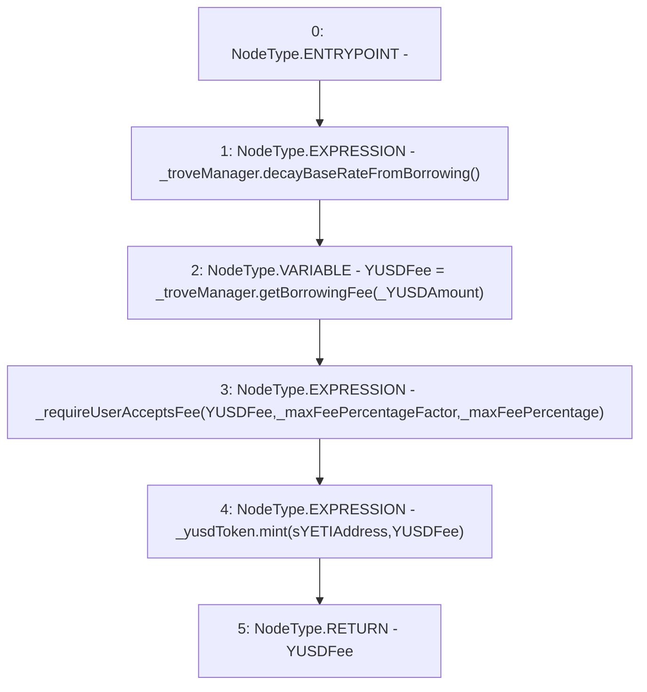

# Context: SortedTrovesBOTester._triggerBorrowingFee

**Contract:** `SortedTrovesBOTester` (Inherits: BorrowerOperations, ReentrancyGuard, IBorrowerOperations, CheckContract, Ownable, LiquityBase, YetiCustomBase, BaseMath, ILiquityBase)
**Signature:** `_triggerBorrowingFee(ITroveManager,IYUSDToken,uint256,uint256,uint256) returns (uint256)`
**Method Selector ID:** `Internal (No Method ID)`
**Visibility:** `internal`
**Environment-Free:** `Yes`
**Modifiers:** None

### State Variables Interaction
- **Reads:** sYETIAddress
- **Writes:** None

### Environment & Verification Flags
- **Uses Foundry Cheatcodes:** No
- **Has Echidna Properties:** No

### Internal Calls Tree
- None

### External Calls / Value Transfers
- `ITroveManager.HIGH_LEVEL_CALL, dest:_troveManager(ITroveManager), function:decayBaseRateFromBorrowing, arguments:[]  `
- `IYUSDToken.HIGH_LEVEL_CALL, dest:_yusdToken(IYUSDToken), function:mint, arguments:['sYETIAddress', 'YUSDFee']  `
- `ITroveManager.TMP_1016(uint256) = HIGH_LEVEL_CALL, dest:_troveManager(ITroveManager), function:getBorrowingFee, arguments:['_YUSDAmount']  `

### Control Flow Graph (CFG)


### Source Mapping
Declared in: `certora-ac-datasets/detasets/web3bugs/dataset/web3bugs/66/packages/contracts/contracts/BorrowerOperations.sol` on lines **1059** to **1074**

```solidity
    function _triggerBorrowingFee(
        ITroveManager _troveManager,
        IYUSDToken _yusdToken,
        uint256 _YUSDAmount,
        uint256 _maxFeePercentageFactor,
        uint256 _maxFeePercentage
    ) internal returns (uint256) {
        _troveManager.decayBaseRateFromBorrowing(); // decay the baseRate state variable
        uint256 YUSDFee = _troveManager.getBorrowingFee(_YUSDAmount);

        _requireUserAcceptsFee(YUSDFee, _maxFeePercentageFactor, _maxFeePercentage);

        // Send fee to sYETI contract
        _yusdToken.mint(sYETIAddress, YUSDFee);
        return YUSDFee;
    }

```
