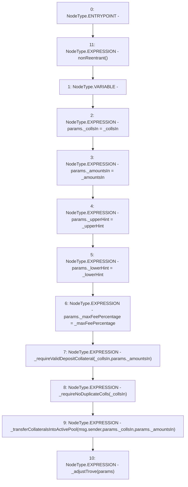

# Context: SortedTrovesBOTester.addColl

**Contract:** `SortedTrovesBOTester` (Inherits: BorrowerOperations, ReentrancyGuard, IBorrowerOperations, CheckContract, Ownable, LiquityBase, YetiCustomBase, BaseMath, ILiquityBase)
**Signature:** `addColl(address[],uint256[],address,address,uint256)`
**Method Selector ID:** `0xe63ce3c0`
**Visibility:** `external`
**Environment-Free:** `No (reads EVM state context)`
**Modifiers:**
- `nonReentrant`
  ```solidity
  modifier nonReentrant() {
          // On the first call to nonReentrant, _notEntered will be true
          require(_status != _ENTERED, "ReentrancyGuard: reentrant call");
  
          // Any calls to nonReentrant after this point will fail
          _status = _ENTERED;
  
          _;
  
          // By storing the original value once again, a refund is triggered (see
          // https://eips.ethereum.org/EIPS/eip-2200)
          _status = _NOT_ENTERED;
      }
  ```

### State Variables Interaction
- **Reads:** None
- **Writes:** None

### Environment & Verification Flags
- **Uses Foundry Cheatcodes:** No
- **Has Echidna Properties:** No

### Internal Calls Tree
- None

### External Calls / Value Transfers
- None

### Control Flow Graph (CFG)


### Source Mapping
Declared in: `certora-ac-datasets/detasets/web3bugs/dataset/web3bugs/66/packages/contracts/contracts/BorrowerOperations.sol` on lines **456** to **477**

```solidity
    function addColl(
        address[] calldata _collsIn,
        uint256[] calldata _amountsIn,
        address _upperHint,
        address _lowerHint, 
        uint256 _maxFeePercentage
    ) external override nonReentrant {
        AdjustTrove_Params memory params;
        params._collsIn = _collsIn;
        params._amountsIn = _amountsIn;
        params._upperHint = _upperHint;
        params._lowerHint = _lowerHint;
        params._maxFeePercentage = _maxFeePercentage;

        // check that all _collsIn collateral types are in the whitelist
        _requireValidDepositCollateral(_collsIn, params._amountsIn);
        _requireNoDuplicateColls(_collsIn); // Check that there is no overlap with in or out in itself

        // pull in deposit collateral
        _transferCollateralsIntoActivePool(msg.sender, params._collsIn, params._amountsIn);
        _adjustTrove(params);
    }

```
