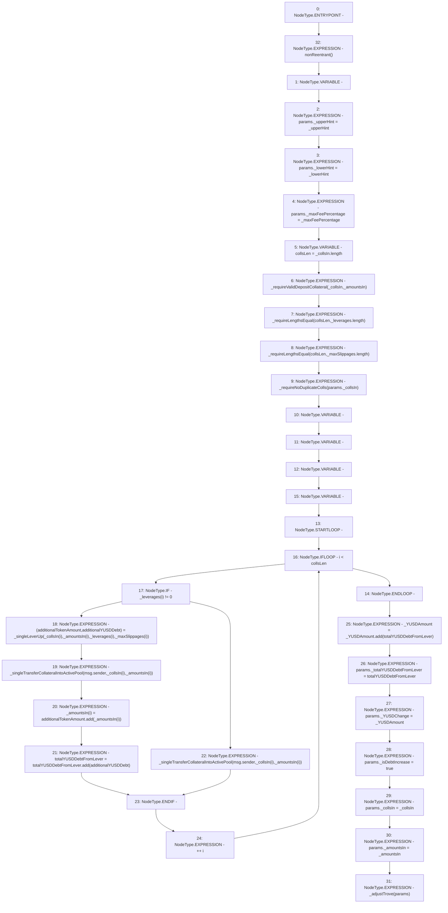

# Context: SortedTrovesBOTester.addCollLeverUp

**Contract:** `SortedTrovesBOTester` (Inherits: BorrowerOperations, ReentrancyGuard, IBorrowerOperations, CheckContract, Ownable, LiquityBase, YetiCustomBase, BaseMath, ILiquityBase)
**Signature:** `addCollLeverUp(address[],uint256[],uint256[],uint256[],uint256,address,address,uint256)`
**Method Selector ID:** `0xf7f7b912`
**Visibility:** `external`
**Environment-Free:** `No (reads EVM state context)`
**Modifiers:**
- `nonReentrant`
  ```solidity
  modifier nonReentrant() {
          // On the first call to nonReentrant, _notEntered will be true
          require(_status != _ENTERED, "ReentrancyGuard: reentrant call");
  
          // Any calls to nonReentrant after this point will fail
          _status = _ENTERED;
  
          _;
  
          // By storing the original value once again, a refund is triggered (see
          // https://eips.ethereum.org/EIPS/eip-2200)
          _status = _NOT_ENTERED;
      }
  ```

### State Variables Interaction
- **Reads:** None
- **Writes:** None

### Environment & Verification Flags
- **Uses Foundry Cheatcodes:** No
- **Has Echidna Properties:** No

### Internal Calls Tree
- None

### External Calls / Value Transfers
- `SafeMath.TMP_848(uint256) = LIBRARY_CALL, dest:SafeMath, function:SafeMath.add(uint256,uint256), arguments:['totalYUSDDebtFromLever', 'additionalYUSDDebt'] `
- `SafeMath.TMP_847(uint256) = LIBRARY_CALL, dest:SafeMath, function:SafeMath.add(uint256,uint256), arguments:['additionalTokenAmount', 'REF_977'] `
- `SafeMath.TMP_850(uint256) = LIBRARY_CALL, dest:SafeMath, function:SafeMath.add(uint256,uint256), arguments:['_YUSDAmount', 'totalYUSDDebtFromLever'] `

### Control Flow Graph (CFG)


### Source Mapping
Declared in: `certora-ac-datasets/detasets/web3bugs/dataset/web3bugs/66/packages/contracts/contracts/BorrowerOperations.sol` on lines **481** to **534**

```solidity
    function addCollLeverUp(
        address[] memory _collsIn,
        uint256[] memory _amountsIn,
        uint256[] memory _leverages,
        uint256[] memory _maxSlippages,
        uint256 _YUSDAmount,
        address _upperHint,
        address _lowerHint, 
        uint256 _maxFeePercentage
    ) external override nonReentrant {
        AdjustTrove_Params memory params;
        params._upperHint = _upperHint;
        params._lowerHint = _lowerHint;
        params._maxFeePercentage = _maxFeePercentage;
        uint256 collsLen = _collsIn.length;

        // check that all _collsIn collateral types are in the whitelist
        _requireValidDepositCollateral(_collsIn, _amountsIn);
        // Must check that other passed in arrays are correct length
        _requireLengthsEqual(collsLen, _leverages.length);
        _requireLengthsEqual(collsLen, _maxSlippages.length);
        _requireNoDuplicateColls(params._collsIn); // Check that there is no overlap with in or out in itself

        uint additionalTokenAmount;
        uint additionalYUSDDebt;
        uint totalYUSDDebtFromLever;
        for (uint256 i; i < collsLen; ++i) {
            if (_leverages[i] != 0) {
                (additionalTokenAmount, additionalYUSDDebt) = _singleLeverUp(
                    _collsIn[i],
                    _amountsIn[i],
                    _leverages[i],
                    _maxSlippages[i]
                );
                // Transfer into active pool, non levered amount. 
                _singleTransferCollateralIntoActivePool(msg.sender, _collsIn[i], _amountsIn[i]);
                // additional token amount was set to the original amount * leverage. 
                _amountsIn[i] = additionalTokenAmount.add(_amountsIn[i]);
                totalYUSDDebtFromLever = totalYUSDDebtFromLever.add(additionalYUSDDebt);
            } else {
                // Otherwise skip and do normal transfer that amount into active pool. 
                _singleTransferCollateralIntoActivePool(msg.sender, _collsIn[i], _amountsIn[i]);
            }
        }
        _YUSDAmount = _YUSDAmount.add(totalYUSDDebtFromLever);
        params._totalYUSDDebtFromLever = totalYUSDDebtFromLever;

        params._YUSDChange = _YUSDAmount;
        params._isDebtIncrease = true;

        params._collsIn = _collsIn;
        params._amountsIn = _amountsIn;
        _adjustTrove(params);
    }

```
