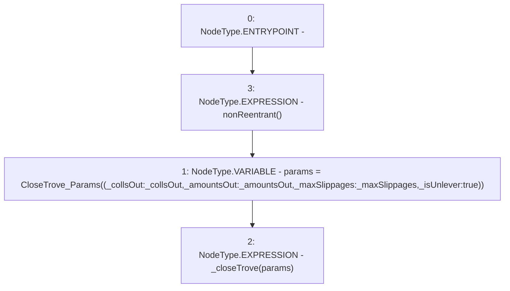

# Context: SortedTrovesBOTester.closeTroveUnlever

**Contract:** `SortedTrovesBOTester` (Inherits: BorrowerOperations, ReentrancyGuard, IBorrowerOperations, CheckContract, Ownable, LiquityBase, YetiCustomBase, BaseMath, ILiquityBase)
**Signature:** `closeTroveUnlever(address[],uint256[],uint256[])`
**Method Selector ID:** `0x5080ab74`
**Visibility:** `external`
**Environment-Free:** `No (reads EVM state context)`
**Modifiers:**
- `nonReentrant`
  ```solidity
  modifier nonReentrant() {
          // On the first call to nonReentrant, _notEntered will be true
          require(_status != _ENTERED, "ReentrancyGuard: reentrant call");
  
          // Any calls to nonReentrant after this point will fail
          _status = _ENTERED;
  
          _;
  
          // By storing the original value once again, a refund is triggered (see
          // https://eips.ethereum.org/EIPS/eip-2200)
          _status = _NOT_ENTERED;
      }
  ```

### State Variables Interaction
- **Reads:** None
- **Writes:** None

### Environment & Verification Flags
- **Uses Foundry Cheatcodes:** No
- **Has Echidna Properties:** No

### Internal Calls Tree
- None

### External Calls / Value Transfers
- None

### Control Flow Graph (CFG)


### Source Mapping
Declared in: `certora-ac-datasets/detasets/web3bugs/dataset/web3bugs/66/packages/contracts/contracts/BorrowerOperations.sol` on lines **881** to **894**

```solidity
    function closeTroveUnlever(
        address[] calldata _collsOut,
        uint256[] calldata _amountsOut,
        uint256[] calldata _maxSlippages
    ) external override nonReentrant {
        CloseTrove_Params memory params = CloseTrove_Params({
            _collsOut: _collsOut,
            _amountsOut: _amountsOut,
            _maxSlippages: _maxSlippages,
            _isUnlever: true
            }
        );
        _closeTrove(params);
    }

```
