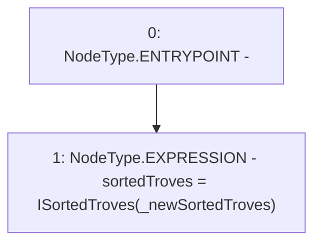

# Context: SortedTrovesBOTester.resetSortedTroves

**Contract:** `SortedTrovesBOTester` (Inherits: BorrowerOperations, ReentrancyGuard, IBorrowerOperations, CheckContract, Ownable, LiquityBase, YetiCustomBase, BaseMath, ILiquityBase)
**Signature:** `resetSortedTroves(address)`
**Method Selector ID:** `0x1056134f`
**Visibility:** `external`
**Environment-Free:** `Yes`
**Modifiers:** None

### State Variables Interaction
- **Reads:** None
- **Writes:** sortedTroves

### Environment & Verification Flags
- **Uses Foundry Cheatcodes:** No
- **Has Echidna Properties:** No

### Internal Calls Tree
- None

### External Calls / Value Transfers
- None

### Control Flow Graph (CFG)


### Source Mapping
Declared in: `certora-ac-datasets/detasets/web3bugs/dataset/web3bugs/66/packages/contracts/contracts/TestContracts/SortedTrovesBOTester.sol` on lines **11** to **13**

```solidity
  function resetSortedTroves(address _newSortedTroves) external {
    sortedTroves = ISortedTroves(_newSortedTroves);
  }

```
