# Context: SortedTrovesBOTester.setAddresses

**Contract:** `SortedTrovesBOTester` (Inherits: BorrowerOperations, ReentrancyGuard, IBorrowerOperations, CheckContract, Ownable, LiquityBase, YetiCustomBase, BaseMath, ILiquityBase)
**Signature:** `setAddresses(address,address,address,address,address,address,address,address,address,address)`
**Method Selector ID:** `0x6c37a4af`
**Visibility:** `external`
**Environment-Free:** `No (reads EVM state context)`
**Modifiers:**
- `onlyOwner`
  ```solidity
  modifier onlyOwner() {
          require(isOwner(), "CallerNotOwner");
          _;
      }
  ```

### State Variables Interaction
- **Reads:** MIN_NET_DEBT
- **Writes:** activePool, collSurplusPool, defaultPool, deploymentTime, gasPoolAddress, sYETIAddress, sortedTroves, stabilityPoolAddress, troveManager, whitelist, yusdToken

### Assertion Checks & Business Requirements
- require/assert: `require(bool,string)(MIN_NET_DEBT != 0,BO:MIN_NET_DEBT==0)`

### Environment & Verification Flags
- **Uses Foundry Cheatcodes:** No
- **Has Echidna Properties:** No

### Internal Calls Tree
- None

### External Calls / Value Transfers
- None

### Control Flow Graph (CFG)

```mermaid
flowchart TD
    Node_0["0: NodeType.ENTRYPOINT - "]
    Node_0 --> Node_33
    Node_1["1: NodeType.EXPRESSION - require(bool,string)(MIN_NET_DEBT != 0,BO:MIN_NET_DEBT==0)"]
    Node_1 --> Node_2
    Node_2["2: NodeType.EXPRESSION - deploymentTime = block.timestamp"]
    Node_2 --> Node_3
    Node_3["3: NodeType.EXPRESSION - checkContract(_troveManagerAddress)"]
    Node_3 --> Node_4
    Node_4["4: NodeType.EXPRESSION - checkContract(_activePoolAddress)"]
    Node_4 --> Node_5
    Node_5["5: NodeType.EXPRESSION - checkContract(_defaultPoolAddress)"]
    Node_5 --> Node_6
    Node_6["6: NodeType.EXPRESSION - checkContract(_stabilityPoolAddress)"]
    Node_6 --> Node_7
    Node_7["7: NodeType.EXPRESSION - checkContract(_gasPoolAddress)"]
    Node_7 --> Node_8
    Node_8["8: NodeType.EXPRESSION - checkContract(_collSurplusPoolAddress)"]
    Node_8 --> Node_9
    Node_9["9: NodeType.EXPRESSION - checkContract(_sortedTrovesAddress)"]
    Node_9 --> Node_10
    Node_10["10: NodeType.EXPRESSION - checkContract(_yusdTokenAddress)"]
    Node_10 --> Node_11
    Node_11["11: NodeType.EXPRESSION - checkContract(_sYETIAddress)"]
    Node_11 --> Node_12
    Node_12["12: NodeType.EXPRESSION - checkContract(_whitelistAddress)"]
    Node_12 --> Node_13
    Node_13["13: NodeType.EXPRESSION - troveManager = ITroveManager(_troveManagerAddress)"]
    Node_13 --> Node_14
    Node_14["14: NodeType.EXPRESSION - activePool = IActivePool(_activePoolAddress)"]
    Node_14 --> Node_15
    Node_15["15: NodeType.EXPRESSION - defaultPool = IDefaultPool(_defaultPoolAddress)"]
    Node_15 --> Node_16
    Node_16["16: NodeType.EXPRESSION - whitelist = IWhitelist(_whitelistAddress)"]
    Node_16 --> Node_17
    Node_17["17: NodeType.EXPRESSION - stabilityPoolAddress = _stabilityPoolAddress"]
    Node_17 --> Node_18
    Node_18["18: NodeType.EXPRESSION - gasPoolAddress = _gasPoolAddress"]
    Node_18 --> Node_19
    Node_19["19: NodeType.EXPRESSION - collSurplusPool = ICollSurplusPool(_collSurplusPoolAddress)"]
    Node_19 --> Node_20
    Node_20["20: NodeType.EXPRESSION - sortedTroves = ISortedTroves(_sortedTrovesAddress)"]
    Node_20 --> Node_21
    Node_21["21: NodeType.EXPRESSION - yusdToken = IYUSDToken(_yusdTokenAddress)"]
    Node_21 --> Node_22
    Node_22["22: NodeType.EXPRESSION - sYETIAddress = _sYETIAddress"]
    Node_22 --> Node_23
    Node_23["23: NodeType.EXPRESSION - TroveManagerAddressChanged(_troveManagerAddress)"]
    Node_23 --> Node_24
    Node_24["24: NodeType.EXPRESSION - ActivePoolAddressChanged(_activePoolAddress)"]
    Node_24 --> Node_25
    Node_25["25: NodeType.EXPRESSION - DefaultPoolAddressChanged(_defaultPoolAddress)"]
    Node_25 --> Node_26
    Node_26["26: NodeType.EXPRESSION - StabilityPoolAddressChanged(_stabilityPoolAddress)"]
    Node_26 --> Node_27
    Node_27["27: NodeType.EXPRESSION - GasPoolAddressChanged(_gasPoolAddress)"]
    Node_27 --> Node_28
    Node_28["28: NodeType.EXPRESSION - CollSurplusPoolAddressChanged(_collSurplusPoolAddress)"]
    Node_28 --> Node_29
    Node_29["29: NodeType.EXPRESSION - SortedTrovesAddressChanged(_sortedTrovesAddress)"]
    Node_29 --> Node_30
    Node_30["30: NodeType.EXPRESSION - YUSDTokenAddressChanged(_yusdTokenAddress)"]
    Node_30 --> Node_31
    Node_31["31: NodeType.EXPRESSION - SYETIAddressChanged(_sYETIAddress)"]
    Node_31 --> Node_32
    Node_32["32: NodeType.EXPRESSION - _renounceOwnership()"]
    Node_33["33: NodeType.EXPRESSION - onlyOwner()"]
    Node_33 --> Node_1
```


### Source Mapping
Declared in: `certora-ac-datasets/detasets/web3bugs/dataset/web3bugs/66/packages/contracts/contracts/BorrowerOperations.sol` on lines **171** to **221**

```solidity
    function setAddresses(
        address _troveManagerAddress,
        address _activePoolAddress,
        address _defaultPoolAddress,
        address _stabilityPoolAddress,
        address _gasPoolAddress,
        address _collSurplusPoolAddress,
        address _sortedTrovesAddress,
        address _yusdTokenAddress,
        address _sYETIAddress,
        address _whitelistAddress
    ) external override onlyOwner {
        // This makes impossible to open a trove with zero withdrawn YUSD
        require(MIN_NET_DEBT != 0, "BO:MIN_NET_DEBT==0");

        deploymentTime = block.timestamp;

        checkContract(_troveManagerAddress);
        checkContract(_activePoolAddress);
        checkContract(_defaultPoolAddress);
        checkContract(_stabilityPoolAddress);
        checkContract(_gasPoolAddress);
        checkContract(_collSurplusPoolAddress);
        checkContract(_sortedTrovesAddress);
        checkContract(_yusdTokenAddress);
        checkContract(_sYETIAddress);
        checkContract(_whitelistAddress);

        troveManager = ITroveManager(_troveManagerAddress);
        activePool = IActivePool(_activePoolAddress);
        defaultPool = IDefaultPool(_defaultPoolAddress);
        whitelist = IWhitelist(_whitelistAddress);
        stabilityPoolAddress = _stabilityPoolAddress;
        gasPoolAddress = _gasPoolAddress;
        collSurplusPool = ICollSurplusPool(_collSurplusPoolAddress);
        sortedTroves = ISortedTroves(_sortedTrovesAddress);
        yusdToken = IYUSDToken(_yusdTokenAddress);
        sYETIAddress = _sYETIAddress;

        emit TroveManagerAddressChanged(_troveManagerAddress);
        emit ActivePoolAddressChanged(_activePoolAddress);
        emit DefaultPoolAddressChanged(_defaultPoolAddress);
        emit StabilityPoolAddressChanged(_stabilityPoolAddress);
        emit GasPoolAddressChanged(_gasPoolAddress);
        emit CollSurplusPoolAddressChanged(_collSurplusPoolAddress);
        emit SortedTrovesAddressChanged(_sortedTrovesAddress);
        emit YUSDTokenAddressChanged(_yusdTokenAddress);
        emit SYETIAddressChanged(_sYETIAddress);

        _renounceOwnership();
    }

```
