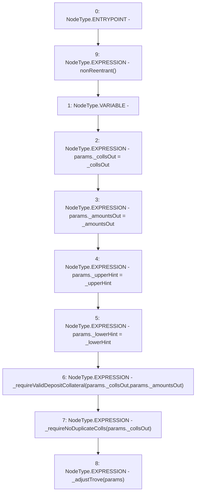

# Context: SortedTrovesBOTester.withdrawColl

**Contract:** `SortedTrovesBOTester` (Inherits: BorrowerOperations, ReentrancyGuard, IBorrowerOperations, CheckContract, Ownable, LiquityBase, YetiCustomBase, BaseMath, ILiquityBase)
**Signature:** `withdrawColl(address[],uint256[],address,address)`
**Method Selector ID:** `0x454a7efd`
**Visibility:** `external`
**Environment-Free:** `No (reads EVM state context)`
**Modifiers:**
- `nonReentrant`
  ```solidity
  modifier nonReentrant() {
          // On the first call to nonReentrant, _notEntered will be true
          require(_status != _ENTERED, "ReentrancyGuard: reentrant call");
  
          // Any calls to nonReentrant after this point will fail
          _status = _ENTERED;
  
          _;
  
          // By storing the original value once again, a refund is triggered (see
          // https://eips.ethereum.org/EIPS/eip-2200)
          _status = _NOT_ENTERED;
      }
  ```

### State Variables Interaction
- **Reads:** None
- **Writes:** None

### Environment & Verification Flags
- **Uses Foundry Cheatcodes:** No
- **Has Echidna Properties:** No

### Internal Calls Tree
- None

### External Calls / Value Transfers
- None

### Control Flow Graph (CFG)


### Source Mapping
Declared in: `certora-ac-datasets/detasets/web3bugs/dataset/web3bugs/66/packages/contracts/contracts/BorrowerOperations.sol` on lines **537** to **554**

```solidity
    function withdrawColl(
        address[] calldata _collsOut,
        uint256[] calldata _amountsOut,
        address _upperHint,
        address _lowerHint
    ) external override nonReentrant {
        AdjustTrove_Params memory params;
        params._collsOut = _collsOut;
        params._amountsOut = _amountsOut;
        params._upperHint = _upperHint;
        params._lowerHint = _lowerHint;

        // check that all _collsOut collateral types are in the whitelist
        _requireValidDepositCollateral(params._collsOut, params._amountsOut);
        _requireNoDuplicateColls(params._collsOut); // Check that there is no overlap with in or out in itself

        _adjustTrove(params);
    }

```
