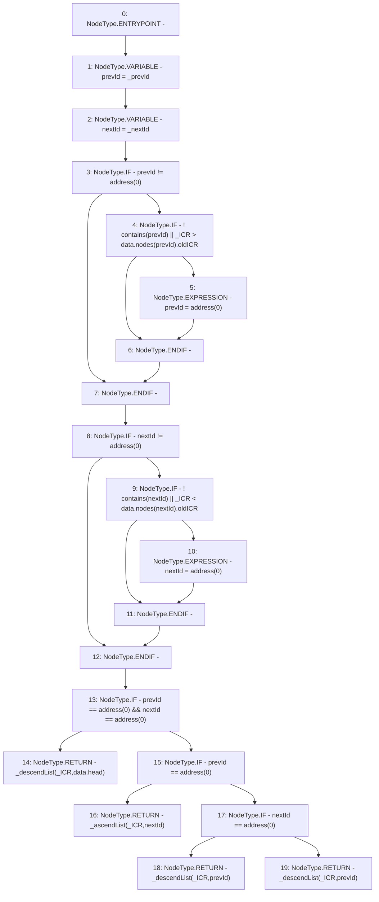

# Context: SortedTrovesTester._findInsertPosition

**Contract:** `SortedTrovesTester` (Inherits: SortedTroves, ISortedTroves, CheckContract, Ownable)
**Signature:** `_findInsertPosition(uint256,address,address) returns (address, address)`
**Method Selector ID:** `Internal (No Method ID)`
**Visibility:** `internal`
**Environment-Free:** `Yes`
**Modifiers:** None

### State Variables Interaction
- **Reads:** data
- **Writes:** None

### Environment & Verification Flags
- **Uses Foundry Cheatcodes:** No
- **Has Echidna Properties:** No

### Internal Calls Tree
- None

### External Calls / Value Transfers
- None

### Control Flow Graph (CFG)


### Source Mapping
Declared in: `certora-ac-datasets/detasets/web3bugs/dataset/web3bugs/66/packages/contracts/contracts/SortedTroves.sol` on lines **398** to **429**

```solidity
    function _findInsertPosition(uint256 _ICR, address _prevId, address _nextId) internal view returns (address, address) {
        address prevId = _prevId;
        address nextId = _nextId;

        if (prevId != address(0)) {
            if (!contains(prevId) || _ICR > data.nodes[prevId].oldICR) {
                // `prevId` does not exist anymore or now has a smaller ICR than the given ICR
                prevId = address(0);
            }
        }

        if (nextId != address(0)) {
            if (!contains(nextId) || _ICR < data.nodes[nextId].oldICR) {
                // `nextId` does not exist anymore or now has a larger ICR than the given ICR
                nextId = address(0);
            }
        }

        if (prevId == address(0) && nextId == address(0)) {
            // No hint - descend list starting from head
            return _descendList(_ICR, data.head);
        } else if (prevId == address(0)) {
            // No `prevId` for hint - ascend list starting from `nextId`
            return _ascendList(_ICR, nextId);
        } else if (nextId == address(0)) {
            // No `nextId` for hint - descend list starting from `prevId`
            return _descendList(_ICR, prevId);
        } else {
            // Descend list starting from `prevId`
            return _descendList(_ICR, prevId);
        }
    }

```
