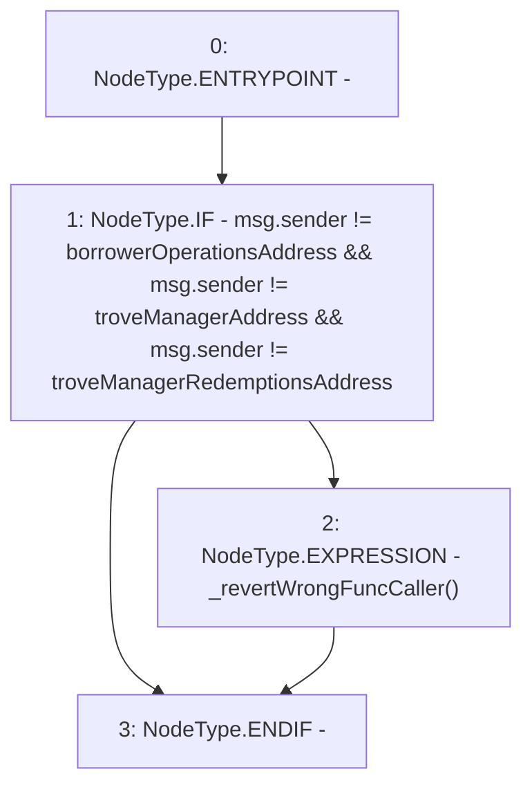

# Context: SortedTrovesTester._requireCallerIsBOorTroveM

**Contract:** `SortedTrovesTester` (Inherits: SortedTroves, ISortedTroves, CheckContract, Ownable)
**Signature:** `_requireCallerIsBOorTroveM()`
**Method Selector ID:** `Internal (No Method ID)`
**Visibility:** `internal`
**Environment-Free:** `No (reads EVM state context)`
**Modifiers:** None

### State Variables Interaction
- **Reads:** borrowerOperationsAddress, troveManagerAddress, troveManagerRedemptionsAddress
- **Writes:** None

### Assertion Checks & Business Requirements
- revert: `_revertWrongFuncCaller()`

### Environment & Verification Flags
- **Uses Foundry Cheatcodes:** No
- **Has Echidna Properties:** No

### Internal Calls Tree
- None

### External Calls / Value Transfers
- None

### Control Flow Graph (CFG)


### Source Mapping
Declared in: `certora-ac-datasets/detasets/web3bugs/dataset/web3bugs/66/packages/contracts/contracts/SortedTroves.sol` on lines **439** to **444**

```solidity
    function _requireCallerIsBOorTroveM() internal view {
        if (msg.sender != borrowerOperationsAddress && msg.sender != troveManagerAddress
                && msg.sender != troveManagerRedemptionsAddress) {
            _revertWrongFuncCaller();
        }
    }

```
