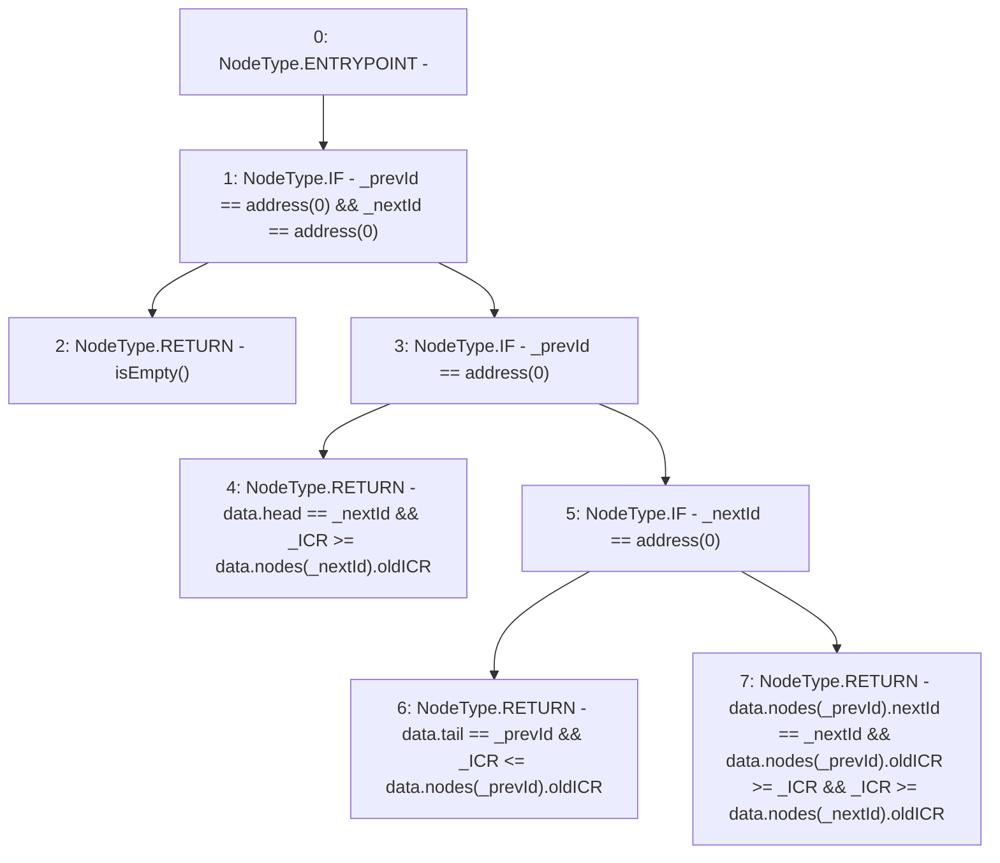

# Context: SortedTrovesTester._validInsertPosition

**Contract:** `SortedTrovesTester` (Inherits: SortedTroves, ISortedTroves, CheckContract, Ownable)
**Signature:** `_validInsertPosition(uint256,address,address) returns (bool)`
**Method Selector ID:** `Internal (No Method ID)`
**Visibility:** `internal`
**Environment-Free:** `Yes`
**Modifiers:** None

### State Variables Interaction
- **Reads:** data
- **Writes:** None

### Environment & Verification Flags
- **Uses Foundry Cheatcodes:** No
- **Has Echidna Properties:** No

### Internal Calls Tree
- None

### External Calls / Value Transfers
- None

### Control Flow Graph (CFG)


### Source Mapping
Declared in: `certora-ac-datasets/detasets/web3bugs/dataset/web3bugs/66/packages/contracts/contracts/SortedTroves.sol` on lines **321** to **337**

```solidity
    function _validInsertPosition(uint256 _ICR, address _prevId, address _nextId) internal view returns (bool) {
        if (_prevId == address(0) && _nextId == address(0)) {
            // `(null, null)` is a valid insert position if the list is empty
            return isEmpty();
        } else if (_prevId == address(0)) {
            // `(null, _nextId)` is a valid insert position if `_nextId` is the head of the list
            return data.head == _nextId && _ICR >= data.nodes[_nextId].oldICR;
        } else if (_nextId == address(0)) {
            // `(_prevId, null)` is a valid insert position if `_prevId` is the tail of the list
            return data.tail == _prevId && _ICR <= data.nodes[_prevId].oldICR;
        } else {
            // `(_prevId, _nextId)` is a valid insert position if they are adjacent nodes and `_ICR` falls between the two nodes' ICRs
            return data.nodes[_prevId].nextId == _nextId &&
                   data.nodes[_prevId].oldICR >= _ICR &&
                    _ICR >= data.nodes[_nextId].oldICR;
        }
    }

```
