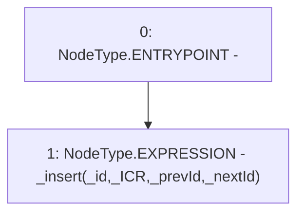

# Context: SortedTrovesTester.callInsert

**Contract:** `SortedTrovesTester` (Inherits: SortedTroves, ISortedTroves, CheckContract, Ownable)
**Signature:** `callInsert(address,uint256,address,address)`
**Method Selector ID:** `0x1859c29c`
**Visibility:** `external`
**Environment-Free:** `Yes`
**Modifiers:** None

### State Variables Interaction
- **Reads:** None
- **Writes:** None

### Environment & Verification Flags
- **Uses Foundry Cheatcodes:** No
- **Has Echidna Properties:** No

### Internal Calls Tree
- None

### External Calls / Value Transfers
- None

### Control Flow Graph (CFG)


### Source Mapping
Declared in: `certora-ac-datasets/detasets/web3bugs/dataset/web3bugs/66/packages/contracts/contracts/TestContracts/SortedTrovesTester.sol` on lines **12** to **14**

```solidity
    function callInsert(address _id, uint256 _ICR, address _prevId, address _nextId) external {
        _insert(_id, _ICR, _prevId, _nextId);
    }

```
