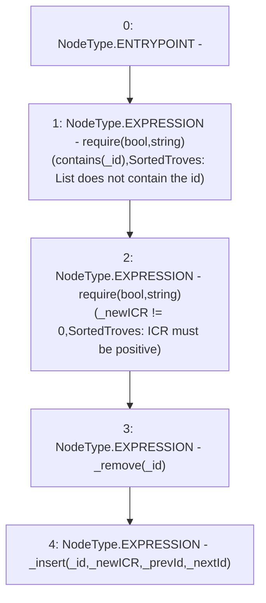

# Context: SortedTrovesTester.callReInsert

**Contract:** `SortedTrovesTester` (Inherits: SortedTroves, ISortedTroves, CheckContract, Ownable)
**Signature:** `callReInsert(address,uint256,address,address)`
**Method Selector ID:** `0x093f67e8`
**Visibility:** `external`
**Environment-Free:** `Yes`
**Modifiers:** None

### State Variables Interaction
- **Reads:** None
- **Writes:** None

### Assertion Checks & Business Requirements
- require/assert: `require(bool,string)(contains(_id),SortedTroves: List does not contain the id)`
- require/assert: `require(bool,string)(_newICR != 0,SortedTroves: ICR must be positive)`

### Environment & Verification Flags
- **Uses Foundry Cheatcodes:** No
- **Has Echidna Properties:** No

### Internal Calls Tree
- None

### External Calls / Value Transfers
- None

### Control Flow Graph (CFG)


### Source Mapping
Declared in: `certora-ac-datasets/detasets/web3bugs/dataset/web3bugs/66/packages/contracts/contracts/TestContracts/SortedTrovesTester.sol` on lines **20** to **29**

```solidity
    function callReInsert(address _id, uint256 _newICR, address _prevId, address _nextId) external {
        require(contains(_id), "SortedTroves: List does not contain the id");
        // ICR must be non-zero
        require(_newICR != 0, "SortedTroves: ICR must be positive");

        // Remove node from the list
        _remove(_id);

        _insert(_id, _newICR, _prevId, _nextId);
    }

```
