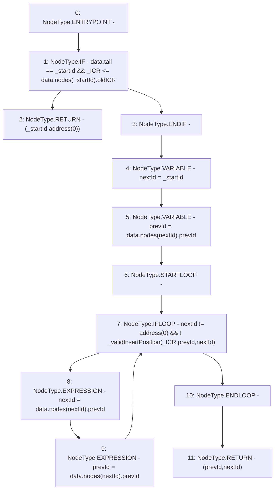

# Context: SortedTroves._ascendList

**Contract:** `SortedTroves` (Inherits: ISortedTroves, CheckContract, Ownable)
**Signature:** `_ascendList(uint256,address) returns (address, address)`
**Method Selector ID:** `Internal (No Method ID)`
**Visibility:** `internal`
**Environment-Free:** `Yes`
**Modifiers:** None

### State Variables Interaction
- **Reads:** data
- **Writes:** None

### Environment & Verification Flags
- **Uses Foundry Cheatcodes:** No
- **Has Echidna Properties:** No

### Internal Calls Tree
- None

### External Calls / Value Transfers
- None

### Control Flow Graph (CFG)


### Source Mapping
Declared in: `certora-ac-datasets/detasets/web3bugs/dataset/web3bugs/66/packages/contracts/contracts/SortedTroves.sol` on lines **367** to **383**

```solidity
    function _ascendList(uint256 _ICR, address _startId) internal view returns (address, address) {
        // If `_startId` is the tail, check if the insert position is after the tail
        if (data.tail == _startId && _ICR <= data.nodes[_startId].oldICR) {
            return (_startId, address(0));
        }

        address nextId = _startId;
        address prevId = data.nodes[nextId].prevId;

        // Ascend the list until we reach the end or until we find a valid insertion point
        while (nextId != address(0) && !_validInsertPosition(_ICR, prevId, nextId)) {
            nextId = data.nodes[nextId].prevId;
            prevId = data.nodes[nextId].prevId;
        }

        return (prevId, nextId);
    }

```
