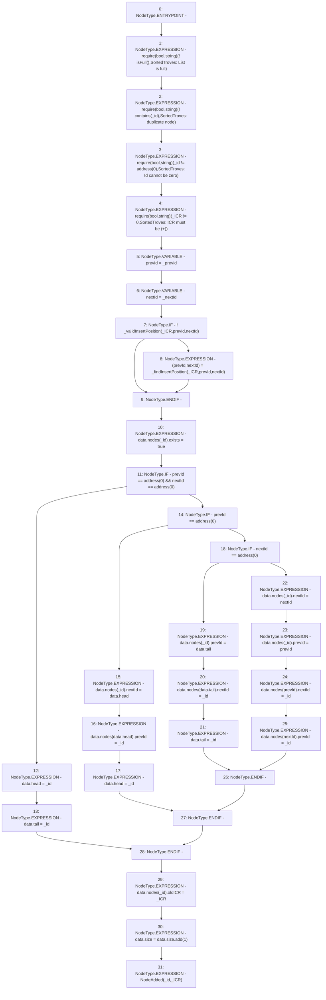

# Context: SortedTroves._insert

**Contract:** `SortedTroves` (Inherits: ISortedTroves, CheckContract, Ownable)
**Signature:** `_insert(address,uint256,address,address)`
**Method Selector ID:** `Internal (No Method ID)`
**Visibility:** `internal`
**Environment-Free:** `Yes`
**Modifiers:** None

### State Variables Interaction
- **Reads:** data
- **Writes:** data

### Assertion Checks & Business Requirements
- require/assert: `require(bool,string)(! isFull(),SortedTroves: List is full)`
- require/assert: `require(bool,string)(! contains(_id),SortedTroves: duplicate node)`
- require/assert: `require(bool,string)(_id != address(0),SortedTroves: Id cannot be zero)`
- require/assert: `require(bool,string)(_ICR != 0,SortedTroves: ICR must be (+))`

### Environment & Verification Flags
- **Uses Foundry Cheatcodes:** No
- **Has Echidna Properties:** No

### Internal Calls Tree
- None

### External Calls / Value Transfers
- `SafeMath.TMP_78(uint256) = LIBRARY_CALL, dest:SafeMath, function:SafeMath.add(uint256,uint256), arguments:['REF_42', '1'] `

### Control Flow Graph (CFG)


### Source Mapping
Declared in: `certora-ac-datasets/detasets/web3bugs/dataset/web3bugs/66/packages/contracts/contracts/SortedTroves.sol` on lines **123** to **168**

```solidity
    function _insert(address _id, uint256 _ICR, address _prevId, address _nextId) internal {
        // List must not be full
        require(!isFull(), "SortedTroves: List is full");
        // List must not already contain node
        require(!contains(_id), "SortedTroves: duplicate node");
        // Node id must not be null
        require(_id != address(0), "SortedTroves: Id cannot be zero");
        // ICR must be non-zero
        require(_ICR != 0, "SortedTroves: ICR must be (+)");
        address prevId = _prevId;
        address nextId = _nextId;
        if (!_validInsertPosition(_ICR, prevId, nextId)) {
            // Sender's hint was not a valid insert position
            // Use sender's hint to find a valid insert position
            (prevId, nextId) = _findInsertPosition(_ICR, prevId, nextId);
        }

         data.nodes[_id].exists = true;
        if (prevId == address(0) && nextId == address(0)) {
            // Insert as head and tail
            data.head = _id;
            data.tail = _id;
        } else if (prevId == address(0)) {
            // Insert before `prevId` as the head
            data.nodes[_id].nextId = data.head;
            data.nodes[data.head].prevId = _id;
            data.head = _id;
        } else if (nextId == address(0)) {
            // Insert after `nextId` as the tail
            data.nodes[_id].prevId = data.tail;
            data.nodes[data.tail].nextId = _id;
            data.tail = _id;
        } else {
            // Insert at insert position between `prevId` and `nextId`
            data.nodes[_id].nextId = nextId;
            data.nodes[_id].prevId = prevId;
            data.nodes[prevId].nextId = _id;
            data.nodes[nextId].prevId = _id;
        }

        // Update node's ICR
        data.nodes[_id].oldICR = _ICR;

        data.size = data.size.add(1);
        emit NodeAdded(_id, _ICR);
    }

```
