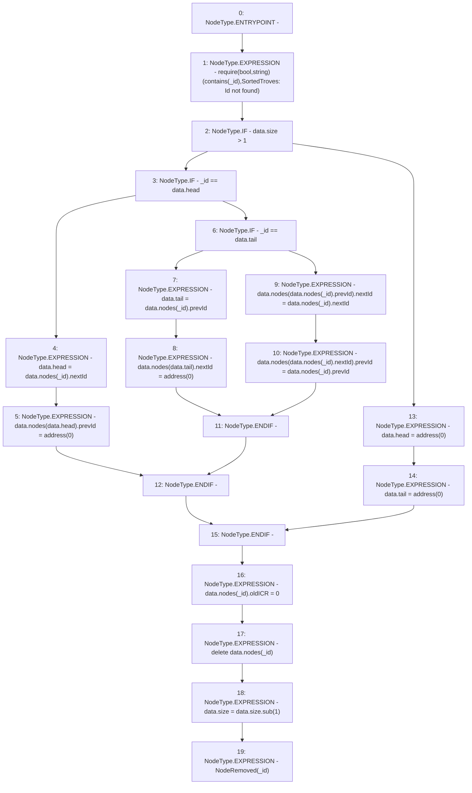

# Context: SortedTroves._remove

**Contract:** `SortedTroves` (Inherits: ISortedTroves, CheckContract, Ownable)
**Signature:** `_remove(address)`
**Method Selector ID:** `Internal (No Method ID)`
**Visibility:** `internal`
**Environment-Free:** `Yes`
**Modifiers:** None

### State Variables Interaction
- **Reads:** data
- **Writes:** data

### Assertion Checks & Business Requirements
- require/assert: `require(bool,string)(contains(_id),SortedTroves: Id not found)`

### Environment & Verification Flags
- **Uses Foundry Cheatcodes:** No
- **Has Echidna Properties:** No

### Internal Calls Tree
- None

### External Calls / Value Transfers
- `SafeMath.TMP_91(uint256) = LIBRARY_CALL, dest:SafeMath, function:SafeMath.sub(uint256,uint256), arguments:['REF_89', '1'] `

### Control Flow Graph (CFG)


### Source Mapping
Declared in: `certora-ac-datasets/detasets/web3bugs/dataset/web3bugs/66/packages/contracts/contracts/SortedTroves.sol` on lines **179** to **216**

```solidity
    function _remove(address _id) internal {
        // List must contain the node
        require(contains(_id), "SortedTroves: Id not found");

        if (data.size > 1) {
            // List contains more than a single node
            if (_id == data.head) {
                // The removed node is the head
                // Set head to next node
                data.head = data.nodes[_id].nextId;
                // Set prev pointer of new head to null
                data.nodes[data.head].prevId = address(0);
            } else if (_id == data.tail) {
                // The removed node is the tail
                // Set tail to previous node
                data.tail = data.nodes[_id].prevId;
                // Set next pointer of new tail to null
                data.nodes[data.tail].nextId = address(0);
            } else {
                // The removed node is neither the head nor the tail
                // Set next pointer of previous node to the next node
                data.nodes[data.nodes[_id].prevId].nextId = data.nodes[_id].nextId;
                // Set prev pointer of next node to the previous node
                data.nodes[data.nodes[_id].nextId].prevId = data.nodes[_id].prevId;
            }
        } else {
            // List contains a single node
            // Set the head and tail to null
            data.head = address(0);
            data.tail = address(0);
        }

        data.nodes[_id].oldICR = 0;

        delete data.nodes[_id];
        data.size = data.size.sub(1);
        emit NodeRemoved(_id);
    }

```
