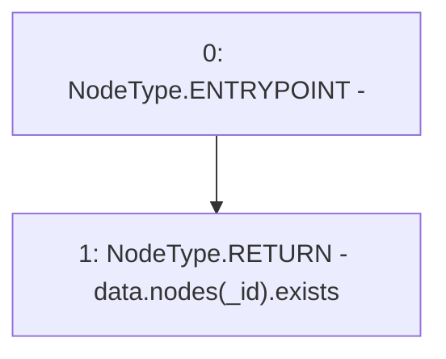

# Context: SortedTroves.contains

**Contract:** `SortedTroves` (Inherits: ISortedTroves, CheckContract, Ownable)
**Signature:** `contains(address) returns (bool)`
**Method Selector ID:** `0x5dbe47e8`
**Visibility:** `public`
**Environment-Free:** `Yes`
**Modifiers:** None

### State Variables Interaction
- **Reads:** data
- **Writes:** None

### Environment & Verification Flags
- **Uses Foundry Cheatcodes:** No
- **Has Echidna Properties:** No

### Internal Calls Tree
- None

### External Calls / Value Transfers
- None

### Control Flow Graph (CFG)


### Source Mapping
Declared in: `certora-ac-datasets/detasets/web3bugs/dataset/web3bugs/66/packages/contracts/contracts/SortedTroves.sol` on lines **241** to **243**

```solidity
    function contains(address _id) public view override returns (bool) {
        return data.nodes[_id].exists;
    }

```
