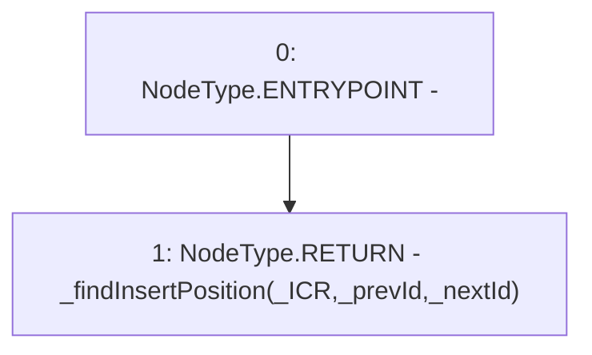

# Context: SortedTroves.findInsertPosition

**Contract:** `SortedTroves` (Inherits: ISortedTroves, CheckContract, Ownable)
**Signature:** `findInsertPosition(uint256,address,address) returns (address, address)`
**Method Selector ID:** `0x416980dc`
**Visibility:** `external`
**Environment-Free:** `Yes`
**Modifiers:** None

### State Variables Interaction
- **Reads:** None
- **Writes:** None

### Environment & Verification Flags
- **Uses Foundry Cheatcodes:** No
- **Has Echidna Properties:** No

### Internal Calls Tree
- None

### External Calls / Value Transfers
- None

### Control Flow Graph (CFG)


### Source Mapping
Declared in: `certora-ac-datasets/detasets/web3bugs/dataset/web3bugs/66/packages/contracts/contracts/SortedTroves.sol` on lines **394** to **396**

```solidity
    function findInsertPosition(uint256 _ICR, address _prevId, address _nextId) external view override returns (address, address) {
        return _findInsertPosition(_ICR, _prevId, _nextId);
    }

```
