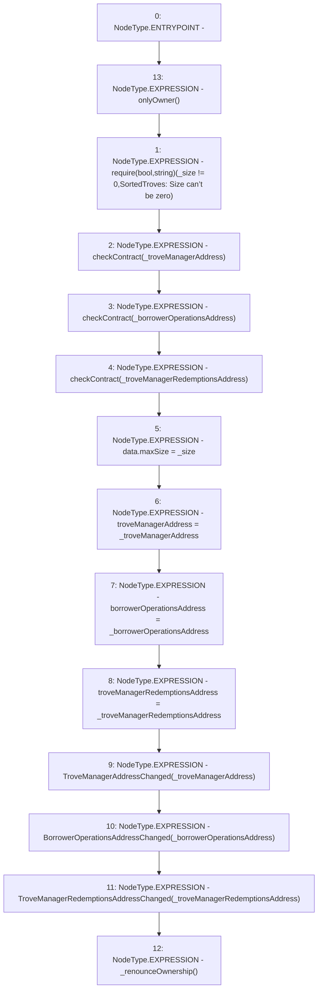

# Context: SortedTroves.setParams

**Contract:** `SortedTroves` (Inherits: ISortedTroves, CheckContract, Ownable)
**Signature:** `setParams(uint256,address,address,address)`
**Method Selector ID:** `0x2cf404dc`
**Visibility:** `external`
**Environment-Free:** `No (reads EVM state context)`
**Modifiers:**
- `onlyOwner`
  ```solidity
  modifier onlyOwner() {
          require(isOwner(), "CallerNotOwner");
          _;
      }
  ```

### State Variables Interaction
- **Reads:** data
- **Writes:** borrowerOperationsAddress, data, troveManagerAddress, troveManagerRedemptionsAddress

### Assertion Checks & Business Requirements
- require/assert: `require(bool,string)(_size != 0,SortedTroves: Size can’t be zero)`

### Environment & Verification Flags
- **Uses Foundry Cheatcodes:** No
- **Has Echidna Properties:** No

### Internal Calls Tree
- None

### External Calls / Value Transfers
- None

### Control Flow Graph (CFG)


### Source Mapping
Declared in: `certora-ac-datasets/detasets/web3bugs/dataset/web3bugs/66/packages/contracts/contracts/SortedTroves.sol` on lines **87** to **108**

```solidity
    function setParams(uint256 _size, 
        address _troveManagerAddress, 
        address _borrowerOperationsAddress,
        address _troveManagerRedemptionsAddress) 
        external override onlyOwner {
        require(_size != 0, "SortedTroves: Size can’t be zero");
        checkContract(_troveManagerAddress);
        checkContract(_borrowerOperationsAddress);
        checkContract(_troveManagerRedemptionsAddress);

        data.maxSize = _size;

        troveManagerAddress = _troveManagerAddress;
        borrowerOperationsAddress = _borrowerOperationsAddress;
        troveManagerRedemptionsAddress = _troveManagerRedemptionsAddress;

        emit TroveManagerAddressChanged(_troveManagerAddress);
        emit BorrowerOperationsAddressChanged(_borrowerOperationsAddress);
        emit TroveManagerRedemptionsAddressChanged(_troveManagerRedemptionsAddress);

        _renounceOwnership();
    }

```
