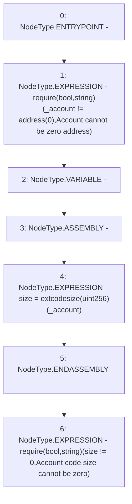

# Context: StabilityPoolScript.checkContract

**Contract:** `StabilityPoolScript` (Inherits: CheckContract)
**Signature:** `checkContract(address)`
**Method Selector ID:** `Internal (No Method ID)`
**Visibility:** `internal`
**Environment-Free:** `Yes`
**Modifiers:** None

### State Variables Interaction
- **Reads:** None
- **Writes:** None

### Assertion Checks & Business Requirements
- require/assert: `require(bool,string)(_account != address(0),Account cannot be zero address)`
- require/assert: `require(bool,string)(size != 0,Account code size cannot be zero)`

### Environment & Verification Flags
- **Uses Foundry Cheatcodes:** No
- **Has Echidna Properties:** No

### Internal Calls Tree
- None

### External Calls / Value Transfers
- None

### Control Flow Graph (CFG)


### Source Mapping
Declared in: `certora-ac-datasets/detasets/web3bugs/dataset/web3bugs/66/packages/contracts/contracts/Dependencies/CheckContract.sol` on lines **11** to **18**

```solidity
    function checkContract(address _account) internal view {
        require(_account != address(0), "Account cannot be zero address");

        uint256 size;
        // solhint-disable-next-line no-inline-assembly
        assembly { size := extcodesize(_account) }
        require(size != 0, "Account code size cannot be zero");
    }

```
