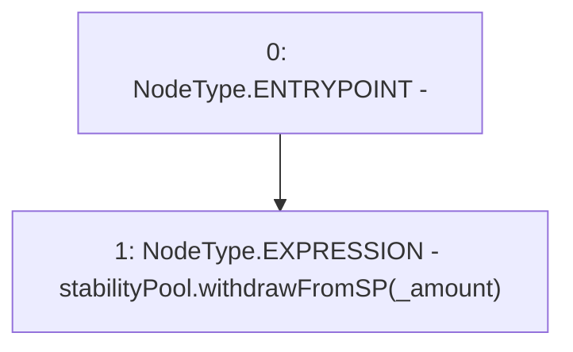

# Context: StabilityPoolScript.withdrawFromSP

**Contract:** `StabilityPoolScript` (Inherits: CheckContract)
**Signature:** `withdrawFromSP(uint256)`
**Method Selector ID:** `0x2e54bf95`
**Visibility:** `external`
**Environment-Free:** `Yes`
**Modifiers:** None

### State Variables Interaction
- **Reads:** stabilityPool
- **Writes:** None

### Environment & Verification Flags
- **Uses Foundry Cheatcodes:** No
- **Has Echidna Properties:** No

### Internal Calls Tree
- None

### External Calls / Value Transfers
- `IStabilityPool.HIGH_LEVEL_CALL, dest:stabilityPool(IStabilityPool), function:withdrawFromSP, arguments:['_amount']  `

### Control Flow Graph (CFG)


### Source Mapping
Declared in: `certora-ac-datasets/detasets/web3bugs/dataset/web3bugs/66/packages/contracts/contracts/Proxy/StabilityPoolScript.sol` on lines **23** to **25**

```solidity
    function withdrawFromSP(uint _amount) external {
        stabilityPool.withdrawFromSP(_amount);
    }

```
