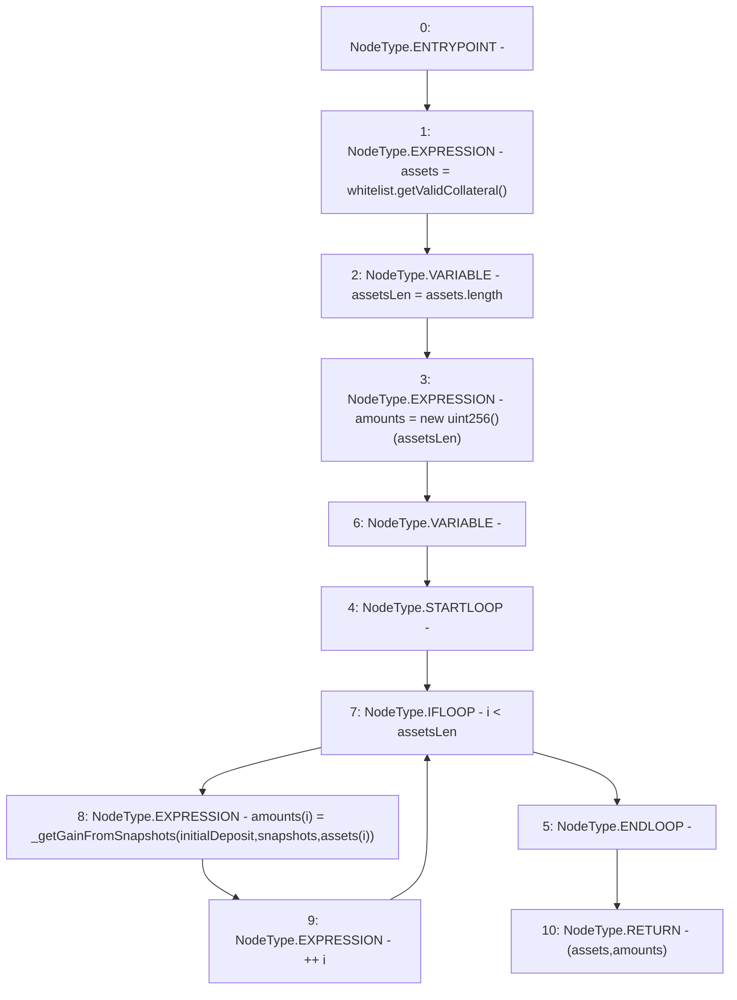

# Context: StabilityPoolTester._calculateGains

**Contract:** `StabilityPoolTester` (Inherits: StabilityPool, IStabilityPool, ICollateralReceiver, CheckContract, Ownable, LiquityBase, YetiCustomBase, BaseMath, ILiquityBase)
**Signature:** `_calculateGains(uint256,StabilityPool.Snapshots) returns (address[], uint256[])`
**Method Selector ID:** `Internal (No Method ID)`
**Visibility:** `internal`
**Environment-Free:** `Yes`
**Modifiers:** None

### State Variables Interaction
- **Reads:** depositSnapshots, whitelist
- **Writes:** None

### Environment & Verification Flags
- **Uses Foundry Cheatcodes:** No
- **Has Echidna Properties:** No

### Internal Calls Tree
- None

### External Calls / Value Transfers
- `IWhitelist.TMP_805(address[]) = HIGH_LEVEL_CALL, dest:whitelist(IWhitelist), function:getValidCollateral, arguments:[]  `

### Control Flow Graph (CFG)


### Source Mapping
Declared in: `certora-ac-datasets/detasets/web3bugs/dataset/web3bugs/66/packages/contracts/contracts/StabilityPool.sol` on lines **717** to **728**

```solidity
    function _calculateGains(uint256 initialDeposit, Snapshots storage snapshots)
        internal
        view
        returns (address[] memory assets, uint256[] memory amounts)
    {
        assets = whitelist.getValidCollateral();
        uint256 assetsLen = assets.length;
        amounts = new uint256[](assetsLen);
        for (uint256 i; i < assetsLen; ++i) {
            amounts[i] = _getGainFromSnapshots(initialDeposit, snapshots, assets[i]);
        }
    }

```
