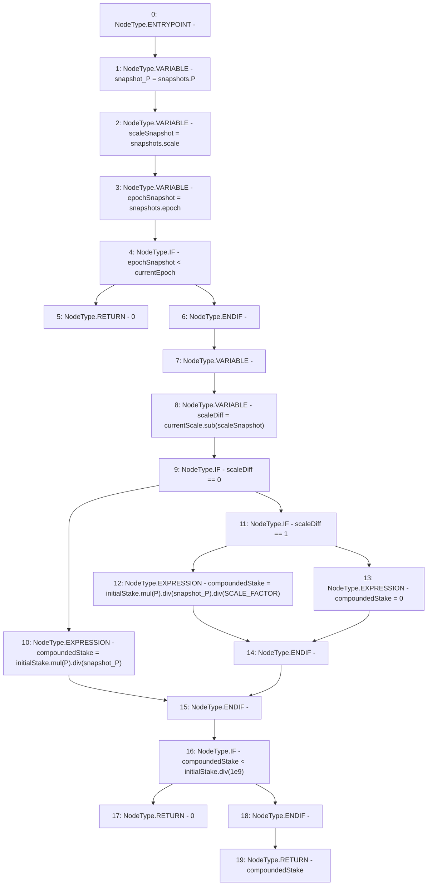

# Context: StabilityPoolTester._getCompoundedStakeFromSnapshots

**Contract:** `StabilityPoolTester` (Inherits: StabilityPool, IStabilityPool, ICollateralReceiver, CheckContract, Ownable, LiquityBase, YetiCustomBase, BaseMath, ILiquityBase)
**Signature:** `_getCompoundedStakeFromSnapshots(uint256,StabilityPool.Snapshots) returns (uint256)`
**Method Selector ID:** `Internal (No Method ID)`
**Visibility:** `internal`
**Environment-Free:** `Yes`
**Modifiers:** None

### State Variables Interaction
- **Reads:** P, SCALE_FACTOR, currentEpoch, currentScale, depositSnapshots, frontEndSnapshots
- **Writes:** None

### Environment & Verification Flags
- **Uses Foundry Cheatcodes:** No
- **Has Echidna Properties:** No

### Internal Calls Tree
- None

### External Calls / Value Transfers
- `SafeMath.TMP_849(uint256) = LIBRARY_CALL, dest:SafeMath, function:SafeMath.div(uint256,uint256), arguments:['initialStake', '1000000000'] `
- `SafeMath.TMP_846(uint256) = LIBRARY_CALL, dest:SafeMath, function:SafeMath.mul(uint256,uint256), arguments:['initialStake', 'P'] `
- `SafeMath.TMP_847(uint256) = LIBRARY_CALL, dest:SafeMath, function:SafeMath.div(uint256,uint256), arguments:['TMP_846', 'snapshot_P'] `
- `SafeMath.TMP_844(uint256) = LIBRARY_CALL, dest:SafeMath, function:SafeMath.div(uint256,uint256), arguments:['TMP_843', 'snapshot_P'] `
- `SafeMath.TMP_843(uint256) = LIBRARY_CALL, dest:SafeMath, function:SafeMath.mul(uint256,uint256), arguments:['initialStake', 'P'] `
- `LiquitySafeMath128.TMP_841(uint128) = LIBRARY_CALL, dest:LiquitySafeMath128, function:LiquitySafeMath128.sub(uint128,uint128), arguments:['currentScale', 'scaleSnapshot'] `
- `SafeMath.TMP_848(uint256) = LIBRARY_CALL, dest:SafeMath, function:SafeMath.div(uint256,uint256), arguments:['TMP_847', 'SCALE_FACTOR'] `

### Control Flow Graph (CFG)


### Source Mapping
Declared in: `certora-ac-datasets/detasets/web3bugs/dataset/web3bugs/66/packages/contracts/contracts/StabilityPool.sol` on lines **884** to **928**

```solidity
    function _getCompoundedStakeFromSnapshots(uint256 initialStake, Snapshots storage snapshots)
        internal
        view
        returns (uint256)
    {
        uint256 snapshot_P = snapshots.P;
        uint128 scaleSnapshot = snapshots.scale;
        uint128 epochSnapshot = snapshots.epoch;

        // If stake was made before a pool-emptying event, then it has been fully cancelled with debt -- so, return 0
        if (epochSnapshot < currentEpoch) {
            return 0;
        }

        uint256 compoundedStake;
        uint128 scaleDiff = currentScale.sub(scaleSnapshot);

        /* Compute the compounded stake. If a scale change in P was made during the stake's lifetime,
         * account for it. If more than one scale change was made, then the stake has decreased by a factor of
         * at least 1e-9 -- so return 0.
         */
        if (scaleDiff == 0) {
            compoundedStake = initialStake.mul(P).div(snapshot_P);
        } else if (scaleDiff == 1) {
            compoundedStake = initialStake.mul(P).div(snapshot_P).div(SCALE_FACTOR);
        } else {
            // if scaleDiff >= 2
            compoundedStake = 0;
        }

        /*
         * If compounded deposit is less than a billionth of the initial deposit, return 0.
         *
         * NOTE: originally, this line was in place to stop rounding errors making the deposit too large. However, the error
         * corrections should ensure the error in P "favors the Pool", i.e. any given compounded deposit should slightly less
         * than it's theoretical value.
         *
         * Thus it's unclear whether this line is still really needed.
         */
        if (compoundedStake < initialStake.div(1e9)) {
            return 0;
        }

        return compoundedStake;
    }

```
