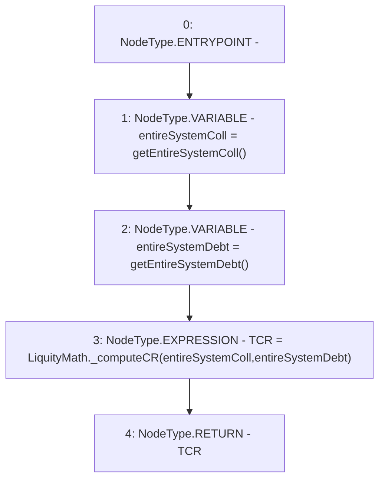

# Context: StabilityPoolTester._getTCR

**Contract:** `StabilityPoolTester` (Inherits: StabilityPool, IStabilityPool, ICollateralReceiver, CheckContract, Ownable, LiquityBase, YetiCustomBase, BaseMath, ILiquityBase)
**Signature:** `_getTCR() returns (uint256)`
**Method Selector ID:** `Internal (No Method ID)`
**Visibility:** `internal`
**Environment-Free:** `Yes`
**Modifiers:** None

### State Variables Interaction
- **Reads:** None
- **Writes:** None

### Environment & Verification Flags
- **Uses Foundry Cheatcodes:** No
- **Has Echidna Properties:** No

### Internal Calls Tree
- None

### External Calls / Value Transfers
- `LiquityMath.TMP_969(uint256) = LIBRARY_CALL, dest:LiquityMath, function:LiquityMath._computeCR(uint256,uint256), arguments:['entireSystemColl', 'entireSystemDebt'] `

### Control Flow Graph (CFG)


### Source Mapping
Declared in: `certora-ac-datasets/detasets/web3bugs/dataset/web3bugs/66/packages/contracts/contracts/Dependencies/LiquityBase.sol` on lines **111** to **116**

```solidity
    function _getTCR() internal view returns (uint TCR) {
        uint entireSystemColl = getEntireSystemColl();
        uint entireSystemDebt = getEntireSystemDebt();
        
        TCR = LiquityMath._computeCR(entireSystemColl, entireSystemDebt);
    }

```
