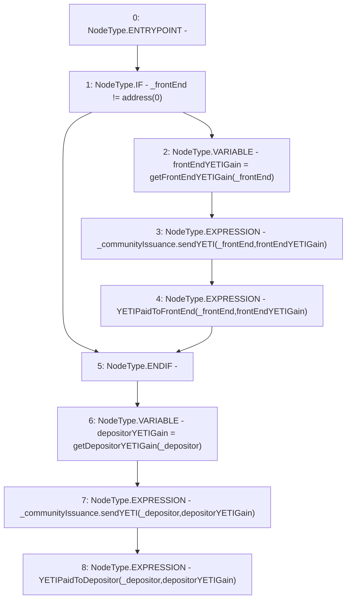

# Context: StabilityPoolTester._payOutYETIGains

**Contract:** `StabilityPoolTester` (Inherits: StabilityPool, IStabilityPool, ICollateralReceiver, CheckContract, Ownable, LiquityBase, YetiCustomBase, BaseMath, ILiquityBase)
**Signature:** `_payOutYETIGains(ICommunityIssuance,address,address)`
**Method Selector ID:** `Internal (No Method ID)`
**Visibility:** `internal`
**Environment-Free:** `Yes`
**Modifiers:** None

### State Variables Interaction
- **Reads:** None
- **Writes:** None

### Environment & Verification Flags
- **Uses Foundry Cheatcodes:** No
- **Has Echidna Properties:** No

### Internal Calls Tree
- None

### External Calls / Value Transfers
- `ICommunityIssuance.HIGH_LEVEL_CALL, dest:_communityIssuance(ICommunityIssuance), function:sendYETI, arguments:['_depositor', 'depositorYETIGain']  `
- `ICommunityIssuance.HIGH_LEVEL_CALL, dest:_communityIssuance(ICommunityIssuance), function:sendYETI, arguments:['_frontEnd', 'frontEndYETIGain']  `

### Control Flow Graph (CFG)


### Source Mapping
Declared in: `certora-ac-datasets/detasets/web3bugs/dataset/web3bugs/66/packages/contracts/contracts/StabilityPool.sol` on lines **1067** to **1083**

```solidity
    function _payOutYETIGains(
        ICommunityIssuance _communityIssuance,
        address _depositor,
        address _frontEnd
    ) internal {
        // Pay out front end's YETI gain
        if (_frontEnd != address(0)) {
            uint256 frontEndYETIGain = getFrontEndYETIGain(_frontEnd);
            _communityIssuance.sendYETI(_frontEnd, frontEndYETIGain);
            emit YETIPaidToFrontEnd(_frontEnd, frontEndYETIGain);
        }

        // Pay out depositor's YETI gain
        uint256 depositorYETIGain = getDepositorYETIGain(_depositor);
        _communityIssuance.sendYETI(_depositor, depositorYETIGain);
        emit YETIPaidToDepositor(_depositor, depositorYETIGain);
    }

```
